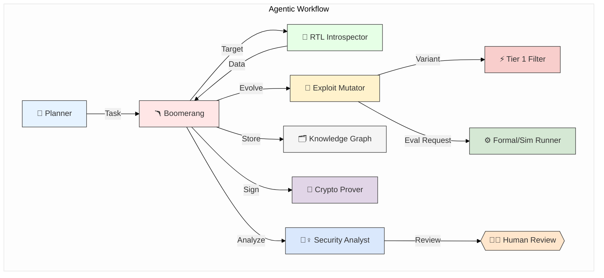
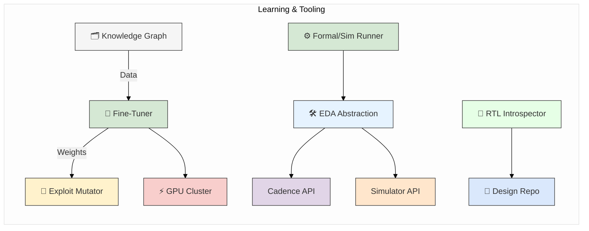

This project leverages intelligent autonomous agents to enhance the security, adaptability, and efficiency of complex software systems. These agents collaborate to identify vulnerabilities, plan secure operations, and dynamically respond to evolving threats. By integrating advanced reasoning and formal verification, the framework aims to provide robust, scalable solutions accessible to both technical experts and semi-technical stakeholders, ensuring clarity, transparency, and trust in automated decision-making.

# 🛡️ Autonomous Hardware Exploit Evolution System (v2.1 - Final)

> **Note:** On-premises deployment significantly aids ITAR compliance by keeping data internal. Full compliance requires additional organizational controls (access restrictions, audits, training, documentation).

---

## 📜 Abstract

An on-premises, ITAR-focused agentic R&D system designed for:

- 🔄 Continuous, adaptive discovery of vulnerabilities in radiation-hardened microelectronics  
- 🔍 Automated analysis and remediation guidance  
- 🧠 Intelligent assistance to Draper's security teams  
- 👥 Incorporation of human oversight for critical decisions  

---

## 🔑 Key Components

- 🧮 Tiered formal methods and simulation  
- 🧬 Advanced genetic algorithm (GA) exploit mutation guided by LoRA fine-tuning  
- 🔄 Continuous, incremental LoRA-based model updates on new exploit data  
- 🔐 Cryptographic supply chain proofs using BLS signatures for exploit lineage  

---

## 🎯 Strategic Alignment

Supports Draper's goal to *"Establish cyber-based V&V capabilities for developmental and fielded systems"* [Draper Strategic Plan 2025].

---

## 🚀 Key Innovations

### 🧬 Tiered & Adaptive Exploit Fitness Evaluation

- Multi-stage pipeline:  
  1. Heuristics  
  2. Behavioral simulation  
  3. Radiation-aware gate-level simulation (GLS) and formal methods  
- Adaptive sampling optimizes computational resources  

### 🧠 Learning-Driven Genetic Algorithm

- Hardware-centric GA with domain-specific mutation operators  
- Guided by LoRA models fine-tuned on Draper data and system discoveries  
- LoRA enables efficient, continuous adaptation to new exploit patterns  

### 🗂️ Evolving Exploit Knowledge Graph

- ArangoDB stores relationships among:  
  - Vulnerabilities  
  - Exploits  
  - Patches  
  - Proofs  
  - Fitness results  

### ☢️ Radiation Awareness

- Integrates Draper's proprietary SEU models into exploit evaluation  
- Enables realistic fault injection and radiation-aware verification  

### 🔐 Verifiable Exploit Lineage

- BLS signatures provide compact, aggregatable cryptographic proofs  
- Ensures tamper-evident exploit evolution history  
- Mandatory human review for high-impact findings  

---

## 🏗️ Core Architecture

---

## ⚙️ Supporting Infrastructure

---

## 🔄 Workflow Overview

1. **📌 Tasking & Introspection**  
   - Planner assigns task  
   - RTLIntrospector analyzes design  

2. **🔄 Evolution Loop**  
   - Mutator generates variants using GA + LoRA guidance  
   - Tiered evaluation (Heuristics → Simulation → Formal)  
   - Adaptive sampling optimizes resource use  

3. **💾 Storage & Signing**  
   - Findings stored in ArangoDB  
   - CryptoProver signs exploit lineage  

4. **🔍 Analysis & Review**  
   - Analyst flags critical items  
   - Mandatory human review for high-impact exploits  

5. **🛠️ Patching (Conditional)**  
   - SeniorCoder develops patches  
   - Librarian generates formal proofs  

---

## 📊 Feasibility Summary

| Aspect                   | Rating             | Notes                                                        |
|--------------------------|--------------------|--------------------------------------------------------------|
| **Technical Viability**  | ⭐⭐⭐⭐⭐⭐⭐⭐ (8/10)   | Builds on proven techniques, complex integration required    |
| **ITAR Compliance**      | ⭐⭐⭐⭐⭐⭐⭐⭐⭐⭐ (10/10)| Fully on-premises (additional controls still required)       |
| **Performance**          | ⭐⭐⭐⭐⭐ (Variable)  | 5–50 meaningful analyses/hour post-tuning                    |
| **Certification Path**   | ⭐⭐⭐⭐⭐ (DO-254)    | Generates verifiable artifacts                               |
| **R&D Focus**            | ⭐⭐⭐⭐⭐⭐⭐⭐ (High)   | Explores advanced AI for vulnerability discovery             |

---

## 🗓️ Implementation Roadmap

*(See `taskplan.md` for detailed Gantt chart)*

**Phases:**

1. **🏗️ Core Infrastructure** (9 weeks)  
2. **☢️ Radiation Hardening** (7 weeks)  
3. **🧠 Fine-Tuning** (8 weeks)  
4. **🔒 Security Integration** (7 weeks)  
5. **🧪 Final Testing** (5 weeks)  

---

## 👥 Agent Roles Summary

*(See `.roomodes` for full definitions)*

| Role            | Description                 | Emoji        |
|-----------------|-----------------------------|--------------|
| 🪃 Boomerang    | Workflow orchestrator       | 🪃           |
| 🧬 Mutator      | Exploit evolution           | 🧬           |
| ⚙️ Runner       | Tiered evaluation           | ⚙️           |
| 🕵️‍♀️ Analyst   | Findings review             | 🕵️‍♀️        |

---

## 🔒 Security Implementation Guidelines

### Access Control
- Enforce strict RBAC and ABAC policies for all agents, data stores, and UI components.
- Segment exploit data, cryptographic keys, and user credentials into isolated database schemas.
- Remove or disable all default accounts in ArangoDB, Docker, and internal services.
- Prohibit shared credentials; issue unique, auditable identities for each user and agent.
- Continuously audit access logs for anomalous or unauthorized activities.

### Key Management
- Store BLS signing keys and other sensitive secrets in hardware security modules (HSMs) or secure vaults.
- Automate key rotation policies with minimal manual intervention.
- Enforce least privilege on key access; only CryptoProver and authorized admins can access signing keys.
- Separate key management duties from exploit development and review roles.
- Track full key lifecycle events (creation, rotation, revocation, destruction).

### Audit Trails
- Centralize all logs (agent actions, exploit mutations, signing events, human reviews) in an immutable, encrypted log store.
- Include precise timestamps, user/agent IDs, and event types.
- Enable real-time alerts on suspicious activities or policy violations.
- Require strong authentication (MFA, certificates) for log access.
- Regularly review audit trails for compliance and incident response.

### Insider Threats
- Apply behavioral analytics to detect anomalous usage patterns by users and agents.
- Enforce least privilege across all roles, minimizing access to sensitive exploit data.
- Conduct regular insider threat training and awareness programs.
- Perform periodic risk assessments targeting privileged users and critical workflows.
- Establish a dedicated insider threat response team with clear escalation paths.

### Recovery Plan Security
- Protect recovery images, backups, and task state files with cryptographic checksums.
- Require MFA for initiating any recovery or restore operations.
- Isolate recovery infrastructure from operational networks to prevent lateral movement.
- Regularly test recovery procedures under adversarial conditions.
- Log all recovery actions with full auditability.

### Social Engineering Defense
- Maintain detailed incident response playbooks for phishing, pretexting, and impersonation attempts.
- Conduct regular phishing simulations targeting all user roles.
- Implement advanced email filtering, URL inspection, and attachment sandboxing.
- Use social engineering testing tools to identify and remediate weaknesses.
- Integrate social engineering defense into ongoing security awareness training.
