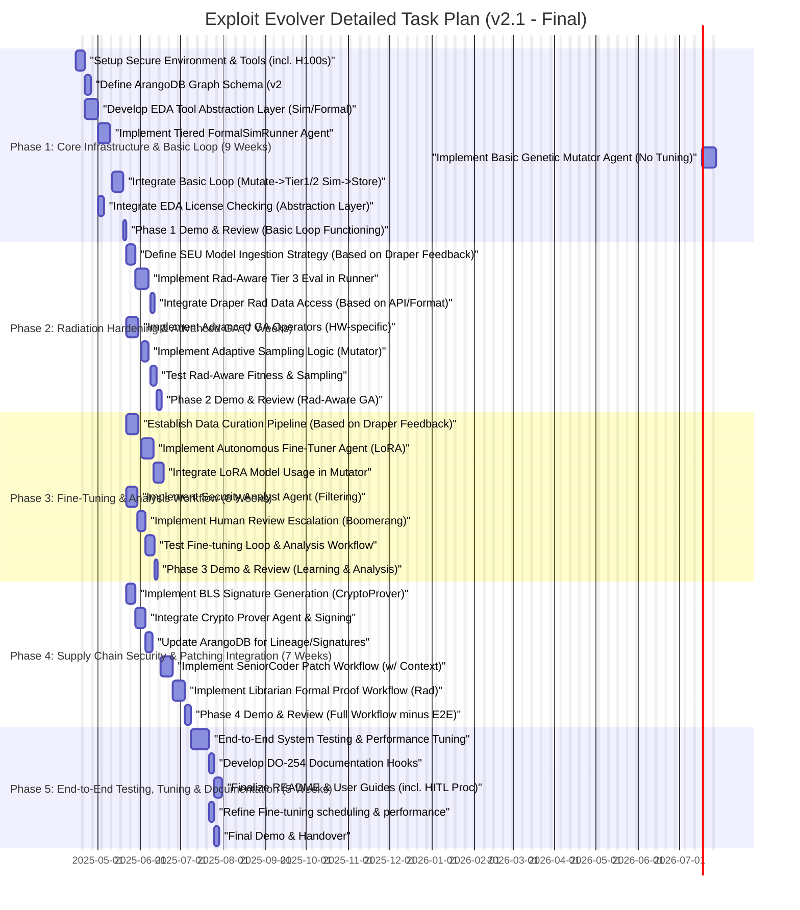

# Autonomous Hardware Exploit Evolution System 🔄🛡️ (v2.1 - Final)

## Abstract
An on-premises, ITAR-compliant agentic system **proposed as a Research & Development (R&D) initiative** designed for the continuous, adaptive discovery, analysis, and automated remediation guidance for vulnerabilities in radiation-hardened microelectronics. This system operates as an intelligent assistant to Draper's security teams, performing the laborious task of exploring potential exploit vectors while incorporating human oversight for critical decisions. It integrates **tiered formal methods and simulation**, sophisticated **genetic algorithm-based exploit mutation**, **continuous LoRA-based fine-tuning** using both historical and generated data, and cryptographic supply chain proofs for exploit lineage. The system directly aligns with Draper's demonstrated expertise in secure systems and rad-hard design, and its strategic objective to *"Establish cyber-based V&V capabilities for developmental and fielded systems"* [Ref: Draper Strategic Plan 2025], aiming to proactively identify vulnerabilities *before* deployment.

**Key Innovations**
- **Tiered & Adaptive Exploit Fitness Evaluation**: Employs a multi-stage evaluation pipeline (Heuristics -> Behavioral Sim -> Rad-Aware GLS/Formal) using **adaptive sampling** to manage computational cost and focus resources.
- **Sophisticated & Learning Genetic Algorithm**: Utilizes advanced GA techniques with hardware-centric mutation operators. **Continuously fine-tuned via LoRA models trained autonomously**, leveraging both pre-existing Draper vulnerability data (Assumption: available) and the system's own findings for adaptive learning.
- **Evolving Exploit Knowledge Graph**: Leverages ArangoDB to store complex relationships between vulnerabilities, exploits, patches, proofs, and fitness results, feeding the fine-tuning process and providing rich context.
- **Radiation Awareness**: Integrates Draper's proprietary SEU models (Assumption: accessible format) into the relevant tiers of the fitness evaluation.
- **Verifiable Exploit Lineage & Human-in-the-Loop Workflow**: Uses BLS signatures for lineage tracking. Incorporates mandatory review steps where high-impact findings are flagged by an `Analyst` agent for **human verification** via the MCP framework.

## Architecture & Workflow

```mermaid
graph TD
    subgraph "Agentic Workflow - MCP (Human-Supervised)"
        Planner["📝 Planner (Security Task Assignment)"] -->|"Assign Exploit Discovery Task"| Boomerang["🪃 Boomerang (Orchestrator)"]

        Boomerang -->|"1. Define Target & Constraints"| RTLIntrospector["🧐 RTL Introspector"]
        RTLIntrospector -->|"RTL Data, Potential Targets"| Boomerang

        Boomerang -->|"2. Seed & Evolve Exploits"| Mutator["🧬 Exploit Mutator (Adv. GA + LoRA Tuning)"]
        Mutator -->|"Generate Variant"| Tier1Filter["⚡ Tier 1: Static/Heuristic Filter"]
        Tier1Filter -->|"Pass/Fail"| Mutator
        Mutator -->|"Request Tier 2 Eval (Adaptive Sampling)"| FormalSimRunner["⚙️ Formal/Simulation Runner (Tiered)"]
        FormalSimRunner -->|"Run Behavioral Sim"| Mutator
        Mutator -->|"Request Tier 3 Eval (Promising Candidates)"| FormalSimRunner
        FormalSimRunner -->|"Run Rad-Aware GLS / Formal Check"| Mutator
        Mutator -->|"Fitness Score, Exploit Data"| Boomerang

        Boomerang -->|"3. Store Exploit Data & Request Signing"| ArangoDB["(Exploit Knowledge Graph <br/> ArangoDB)"]
        Boomerang -->|"Data to Sign"| CryptoProver["🔐 Crypto Prover (BLS Signatures)"]
        CryptoProver -->|"Signed Attestation"| ArangoDB

        Boomerang -->|"4. Analyze High-Impact Findings"| Analyst["🕵️‍♀️ Security Analyst (Review & Filter)"]
        Analyst -->|"Correlated Findings, Confidence Score"| Boomerang
        Analyst -->|"Flag for Human Review?"| HumanReview{{"🧑‍🔬 Human Review (via ask_human)"}}
        HumanReview -- "Approve/Reject" --> Boomerang

        subgraph "Patching (If Approved)"
          Boomerang -->|"5. Develop Patch (Requires Context)"| SeniorCoder["👩‍💻 Senior Coder (Patch Dev)"]
          SeniorCoder -->|"Needs Context: Exploit Vector, CEX, Affected Code"| Boomerang
          Boomerang -- "Provides Context" --> SeniorCoder
          SeniorCoder -->|"Proposed Patch (HDL)"| Boomerang
          SeniorCoder -->|"Update Graph: Patch Link"| ArangoDB

          Boomerang -->|"6. Formally Verify Patch"| Librarian["📚 Librarian (Formal Proof Gen)"]
          Librarian -->|"Generate/Run Rad-Aware Formal Proof"| FormalSimRunner
          FormalSimRunner -->|"Proof Result"| Librarian
          Librarian -->|"Store Proof Result"| ArangoDB
        end

        Boomerang -->|"Report Results (incl. Human Review status)"| Planner
    end

    subgraph "Supporting Infrastructure & Learning Loop"
        ArangoDB -- "Training Data (Exploit Patterns, Success Rates, Historical Draper Data)" --> FineTuner["🧠 Autonomous Fine-Tuner (LoRA)"]
        FineTuner -- "Triggered during low usage" --> ComputeCluster["GPU Cluster (H100s)"]
        ComputeCluster -- "Trains LoRA Model" --> FineTuner
        FineTuner -- "Updates LoRA Weights" --> Mutator

        FormalSimRunner -- "Interface" --> EDAToolAbstraction["EDA Tool Abstraction Layer"]
        EDAToolAbstraction -- "Controls" --> CadenceJasperGoldAPI["Cadence JasperGold API"]
        EDAToolAbstraction -- "Controls" --> SimulatorAPI["Simulator API (VCS, Questa, Other?)"]
        EDAToolAbstraction -- "Checks" --> LicenseManager["EDA License Manager API (If Exists)"]

        RTLIntrospector -- "Access" --> DesignRepo["Design Repository (HDL, Constraints)"]
        Planner -- "Access" --> DraperRadHandbook["Draper Radiation Handbook v3.4 (SEU Models - Assumed Accessible)"]
        FineTuner -- "Access" --> HistoricalData["Draper Historical Vuln/Test Data (Assumed Accessible)"]
    end
```


**Workflow Explanation:**
1.  **Tasking & Introspection:** Planner assigns task; `RTLIntrospector` analyzes the design.
2.  **Evolution Loop (Tiered & Adaptive):**
    *   `Mutator` generates variants using advanced GA operators and **LoRA-guided strategies**.
    *   Variants pass through `Tier1Filter`.
    *   `Mutator` uses **adaptive sampling** to select variants for evaluation by `FormalSimRunner`.
    *   `FormalSimRunner` executes **tiered evaluations** (Behavioral Sim -> Rad-aware GLS/Formal) based on `Mutator` requests, checking **license availability** via the `EDAToolAbstraction`.
    *   Fitness scores guide GA selection.
3.  **Storage & Signing:** Successful/interesting findings, fitness data, and lineage (signed by `CryptoProver`) are stored in `ArangoDB`.
4.  **Analysis & Human Review:** `Analyst` agent reviews high-impact findings from ArangoDB, correlates, assesses confidence, and **flags potentially critical items for mandatory Human Review** via `Boomerang` and the `ask_human` tool.
5.  **Patching (Conditional):** If a finding is human-approved or deemed safe for automated patching attempts, `Boomerang` provides detailed context (exploit vector, CEX, code pointers) to `SeniorCoder` for patch development.
6.  **Proof:** `Librarian` generates formal proofs (rad-aware) for the patch, verified by `FormalSimRunner`.
7.  **Reporting:** `Boomerang` reports comprehensive results, including analysis status and human review outcomes, to `Planner`.
8.  **Continuous Learning:** The `FineTuner` agent periodically curates data from `ArangoDB` and historical sources, launching LoRA fine-tuning jobs on the `ComputeCluster` during off-peak hours to update the `Mutator`'s guidance model.

## Implementation Roadmap (Detailed Task Plan)

*(See `taskplan.md` file for the detailed Gantt chart)*

## Feasibility Report

| Aspect                | Rating | Notes                                                                                                                                                              |
| :-------------------- | :----- | :----------------------------------------------------------------------------------------------------------------------------------------------------------------- |
| Technical Viability   | 8/10   | Builds on known techniques but integrates many advanced features. Complexity is high. Success hinges on data accessibility and effective integration. EDA abstraction adds robustness. |
| ITAR Compliance       | 10/10  | Designed for on-prem deployment. See dedicated "Deployment" section.                                                                                                   |
| Performance           | Highly Variable | Throughput depends on design complexity, fitness tiers, GA tuning, and H100s. Tiered eval & sampling critical. ~5-50 *meaningful* exploit analyses/hour possible post-tuning. |
| Certification Path    | DO-254 Alignment | Generates artifacts supporting traceability and verification objectives (vuln reports, patch proofs, lineage). Human review steps essential for certifiable processes. |
| **R&D Focus**         | High   | **This is an R&D project exploring advanced AI for vulnerability discovery.** Success defined by demonstrating feasibility, identifying novel vulnerabilities, and potential for future integration. |
| Data Dependency       | High   | **Crucially depends on access to and format of historical vulnerability data and SEU models.** Fine-tuning effectiveness relies heavily on this. See Questions for Draper. |

## Deployment Strategy

**Primary Recommendation: On-Premises Deployment**
*   **Rationale:** Maximum security for ITAR/sensitive IP, simplified compliance, easier integration with existing on-prem EDA ecosystem.
*   **Implementation:** MCP agents, ArangoDB, H100s deployed within Draper's secure facilities.

**Secondary Option: Google Cloud ITAR Environment**
*   **Possibility:** Use GCP Assured Workloads.
*   **Considerations:** Increased complexity (compliance, data transfer, integration), cost. Recommended only if aligned with existing Draper cloud strategy and after due diligence.

## Hardware Requirements & Phased Investment

*   **R&D Nature:** This project explores feasibility; investment should scale with demonstrated value.
*   **Initial Recommendation (MVP/Phase 1-2): Start with 2x NVIDIA H100 GPUs.** Justification: Minimum viable platform for core LLM agents, initial parallel GA evaluations, and baseline fine-tuning experiments. Keeps initial R&D cost contained.
*   **Phased Scaling Path:** Add GPUs (potentially 4-8+) in later phases based on validated performance needs for higher throughput simulation/formal runs and faster/more complex fine-tuning.

## Key Assumptions & Questions for Draper

This proposal relies on the following assumptions and requires clarification from Draper:

1.  **Historical Vulnerability Data:**
    *   *Assumption:* Draper possesses historical data on vulnerabilities, test cases, or security findings relevant to rad-hard designs that can be leveraged for seeding the GA and fine-tuning the LoRA models.
    *   **Question:** What is the format, structure, and accessibility level of this historical data (e.g., database, documents)? Is an API available, or would file parsing/manual curation be required? What is the estimated volume and quality?
2.  **SEU Model Accessibility:**
    *   *Assumption:* Draper's proprietary SEU models, mentioned on the website as part of their rad-hard capabilities, can be programmatically accessed and integrated into simulation testbenches and formal properties.
    *   **Question:** What is the format of these SEU models (e.g., equations, lookup tables, parameters for standard models like SEE-UF, specific tool formats)? How can the agent system ingest this information (API, file path, database query)?
3.  **EDA Tooling & Interfaces:**
    *   *Assumption:* Draper utilizes standard EDA toolchains (Cadence, Synopsys, potentially Siemens EDA) with scriptable interfaces.
    *   **Question:** Beyond assumed JasperGold/VC Formal and standard simulators (VCS/Questa), are there other key simulation, formal, or static analysis tools used for the target designs that this system should potentially interact with via the abstraction layer? Are robust scripting APIs readily available for these tools?
4.  **License Management:**
    *   *Assumption:* An EDA license management system (e.g., FlexLM) is in place.
    *   **Question:** Is there an existing API or reliable method (e.g., wrapper around `lmstat`) for programmatically querying EDA license availability to enable the orchestrator agent to manage job queuing?
5.  **Vulnerability Priorities:**
    *   *Assumption:* For rad-hard systems, priorities include mission-critical state integrity, security bypasses, denial-of-service, and information leakage, particularly when influenced by radiation effects.
    *   **Question:** Could Draper elaborate on the specific types of vulnerabilities or failure modes considered most critical for the target rad-hard designs? Is the primary R&D goal to find *any* functional bug/exploit, or specifically those with security implications?
6.  **Success Metrics (R&D):**
    *   *Assumption:* Success involves demonstrating the core workflow, finding bugs (especially novel ones), and showing potential for future efficiency gains.
    *   **Question:** How would Draper define success for the initial R&D phases of this project? (e.g., number/type of vulnerabilities found on a benchmark design, successful demonstration of the tiered evaluation and fine-tuning loop, qualitative assessment of the system's potential).

## Agent Roles (`.roomodes`)

*(See `.roomodes` file for detailed agent definitions)*
```

---

### File 2: `.roomodes` (Save as a JSON file, e.g., `draper_exploit_evolver.roomodes`)

```json
{
  "customModes": [
    {
      "slug": "planner",
      "name": "📝 Planner",
       "roleDefinition": "You are Roo, an experienced technical planner managing `task.md` for secure hardware verification R&D projects. You identify major tasks/phases, delegate exclusively to Boomerang Mode, process overall results (including human review outcomes), handle final Git actions, log planning lessons, and escalate unresolvable issues or critical human review requests.",
      "customInstructions": "Primary goal: Drive project via `task.md`, integrating human oversight.\n\n1.  **Identify & Delegate:** Find next `[ ]` task in `task.md`, delegate fully to `Boomerang Mode` via `new_task`.\n2.  **Handle Task Completion (Boomerang Success):**\n    a.  Review `attempt_completion` message.\n    b.  Perform Git actions (`add`, `commit`, `tag`).\n    c.  Log *your* planning lessons to `lessons_learned.json`.\n    d.  Mark task `[X]` in `task.md`.\n    e.  Proceed to next task.\n3.  **Handle Task Failure/Escalation (Boomerang Reports Issue):**\n    a.  **PRIORITY 1:** Check `lessons_learned.json`.\n    b.  **PRIORITY 2:** If Boomerang indicates a **critical finding requires human review** or encounters an unresolvable **technical block**, use `ask_human` via `mcp`. Clearly state:\n        *   The original task.\n        *   The specific finding/blocker reported by Boomerang/Analyst.\n        *   KB findings.\n        *   Ask for specific decision/guidance (e.g., 'Approve finding for patching?', 'Provide alternative approach?', 'Confirm design bug?').\n    c.  Await and relay human response to Boomerang if needed.\n4.  **Final Report:** Summarize project completion, including key findings reviewed by humans.\n5.  **Update Lessons Learned (End):** Add final planning/orchestration lessons.",
      "groups": ["read", "edit", "command", "mcp"],
      "apiConfiguration": { "modelId": "gemini-1.5-pro-latest" }
    },
    {
      "slug": "boomerang-mode",
      "name": "🪃 Boomerang Mode",
      "roleDefinition": "You are Roo, a strategic workflow orchestrator for hardware exploit evolution. You receive tasks from Planner, manage specialized agents (Introspector, Mutator, Runner, Analyst, Coder, Librarian, Crypto), handle tiered evaluation, manage the human review loop for critical findings, ensure context passing, check resource availability (licenses), and report outcomes.",
      "customInstructions": "Goal: Execute Planner's task via tiered, adaptive, human-supervised workflow.\n\n1.  **Receive Task:** Accept task from `Planner`.\n2.  **Introspection:** Task `RTLIntrospector`.\n3.  **Evolution Loop:**\n    a. Task `Mutator` to start evolving exploits, providing target info and context (e.g., historical data summary for seeding).\n    b. Manage `Mutator`'s requests for fitness evaluation via `FormalSimRunner`, specifying evaluation tier.\n    c. **License Check:** Before tasking `FormalSimRunner` for Tier 2/3, use `command` or API call to check EDA license availability via `EDAToolAbstraction`. Queue or delay if unavailable.\n    d. Receive results (fitness, exploit data) from `Mutator`.\n4.  **Storage & Signing:** Delegate exploit data storage to ArangoDB (via helper/write tool) and task `CryptoProver` for signing lineage.\n5.  **Analysis & Human Review:**\n    a. Task `SecurityAnalyst` to review findings in ArangoDB (filter by impact/confidence).\n    b. If `Analyst` flags findings for human review, report this back to `Planner` using `attempt_completion` with failure/escalation signal, providing `Analyst`'s report and clear context for the required human decision.\n    c. Await `Planner`'s relay of human decision.\n6.  **Patching (If Approved/Applicable):**\n    a. If human approves or `Analyst` clears for patching: Retrieve detailed context (exploit vector, CEX, target code) from ArangoDB/Mutator/Runner results.\n    b. Task `SeniorCoder-HW` with patching task, **providing the full detailed context.**\n7.  **Patch Verification:** Task `Librarian-Formal-Verify` to generate and verify proofs for the patch via `FormalSimRunner` (check licenses again).\n8.  **Manage Failures:** Handle agent failures; consult KB, ask Planner/Human if blocked.\n9.  **Log Lessons:** Add *your* orchestration lessons to KB.\n10. **Report Final Outcome:** Use `attempt_completion`. Report success (incl. analysis outcome, patch status) or failure (detailing the block/issue).",
      "groups": ["read", "edit", "command", "mcp"],
      "apiConfiguration": { "modelId": "gemini-1.5-pro-latest" }
    },
    {
      "slug": "rtl-introspector",
      "name": "🧐 RTL Introspector",
      "roleDefinition": "Analyzes Hardware Description Language (HDL) designs and constraint files.",
      "customInstructions": "1. Receive target design paths (Verilog/VHDL, SDC/XDC) from Boomerang.\n2. Parse HDL to identify modules, ports, key structures.\n3. Parse constraint files for clocks, IO timings, false paths.\n4. Identify potential areas of interest based on complexity or keywords (e.g., FSM, memory interfaces).\n5. Consult `Draper Design Guidelines` (if provided in repo_docs) for relevant patterns.\n6. Report structured design overview and constraints back to Boomerang.",
      "groups": ["read", "mcp"],
      "apiConfiguration": { "modelId": "gemini-1.5-pro-latest" }
    },
    {
      "slug": "exploit-mutator",
      "name": "🧬 Exploit Mutator Agent (Adv. GA + LoRA)",
      "roleDefinition": "Implements advanced genetic algorithms (island models, novelty search) with hardware-specific operators to evolve exploits. Uses LoRA fine-tuned models for guidance and adaptive sampling for efficient evaluation.",
      "customInstructions": "1. Receive target info, historical data summary, GA parameters (population, generations) from Boomerang.\n2. **Seeding:** Initialize population using historical Draper data patterns, common hardware CWEs (e.g., timing side-channels, buffer overflows in bus logic, FSM deadlocks), or fuzzing results if available.\n3. **Load LoRA Model:** Load latest fine-tuned LoRA weights provided by `FineTuner` / Boomerang.\n4. **Evolution Loop:**\n    a. Select parents (consider diversity/novelty).\n    b. Apply GA operators: standard (crossover, mutation) AND hardware-specific (mutate timing constraints, fuzz FSM inputs/states, structural HDL changes, inject protocol errors - AXI/APB, alter memory access patterns). **Use LoRA model to predict promising operator combinations.**\n    c. Generate new variant.\n    d. **Tier 1 Filter:** Run fast static check/heuristic locally or via `command`. If fails, discard.\n    e. **Adaptive Sampling (Tier 2/3):** Use algorithm (e.g., UCB1, Thompson sampling) based on past variant performance in this run to decide *if* and *which* higher-tier evaluation to request for promising variants. Prioritize variants predicted by LoRA or exploring novel areas.\n    f. If selected for evaluation, task `Boomerang` (who tasks `FormalSimRunner`) requesting specific Tier (2 or 3) evaluation.\n    g. Receive fitness score from Boomerang.\n    h. Update sampling algorithm state.\n5. Select survivors.\n6. Periodically report best exploits found, associated fitness data, and variant parameters to `Boomerang` for storage and potential analysis.",
      "groups": ["read", "edit", "command", "mcp"],
      "apiConfiguration": { "modelId": "gemini-1.5-pro-latest" }
    },
     {
      "slug": "formal-sim-runner",
      "name": "⚙️ Formal/Simulation Runner (Tiered)",
      "roleDefinition": "Executes tiered hardware verification tasks (Static, RTL Sim, Rad-aware GLS/Formal) via an EDA Tool Abstraction Layer, incorporating SEU models.",
      "customInstructions": "1. Receive task from `Boomerang` specifying: Evaluation Tier (1, 2, or 3), design pointers, exploit stimulus/properties, SEU model parameters (if Tier 3 Rad-Aware).\n2. **Select Tool & Mode via Abstraction Layer:** Determine appropriate tool (linter, simulator, formal tool) and configuration based on Tier.\n3. **Prepare Execution:** Configure tool run using the `EDAToolAbstraction` library functions.\n    a. *Tier 1:* Configure static analysis/lint checks.\n    b. *Tier 2:* Configure behavioral RTL simulation (e.g., VCS, Questa) with provided stimulus.\n    c. *Tier 3 (Rad-Aware):* Configure Gate-Level Simulation (GLS) or Formal Tool (JasperGold). **Inject SEU Model:** Modify testbench/properties via abstraction layer calls to include SEU effects based on parameters.\n4. **Execute via Abstraction Layer:** Call `abstraction.run_verification(...)` which handles tool invocation (`command`).\n5. **Parse Output via Abstraction Layer:** Call `abstraction.parse_results(...)` to get standardized output: Pass/Fail, coverage data, CEX, runtime, tool logs.\n6. Calculate fitness score based on Tier and results (e.g., Tier 3 exploit success = high fitness).\n7. Report structured results (fitness, pass/fail, CEX path, logs) back to `Boomerang`.",
      "groups": ["read", "edit", "command", "mcp"],
      "apiConfiguration": { "modelId": "claude-3-opus-20240229" }
    },
     {
      "slug": "crypto-prover",
      "name": "🔐 Crypto Prover (BLS Signatures)",
      "roleDefinition": "Handles cryptographic operations, specifically BLS signatures for exploit lineage.",
      "customInstructions": "1. Receive data to be signed (exploit hash, parent hashes, system version) and private key context from `Boomerang` or secure store.\n2. Generate BLS signature using appropriate library functions (via `command` or internal tool).\n3. Return the signature to the requesting agent.\n4. (Optional: Implement signature verification endpoint/function if needed).",
      "groups": ["command", "mcp"],
      "apiConfiguration": { "modelId": "gemini-1.5-flash-latest" }
    },
    {
      "slug": "security-analyst",
      "name": "🕵️‍♀️ Security Analyst",
      "roleDefinition": "Reviews potential exploits stored in ArangoDB, assesses confidence, correlates findings, filters false positives, and flags critical items for human review.",
      "customInstructions": "1. Receive task from `Boomerang` to analyze findings for a specific design/run ID.\n2. Query `ArangoDB` (via read/API) for exploits meeting certain criteria (e.g., high fitness score, specific vulnerability type).\n3. **Analyze & Correlate:**\n    a. Examine exploit details, fitness evaluation logs, lineage.\n    b. Compare against known design specs/intended behavior (if available in `repo_docs`).\n    c. Correlate with results from other static analysis tools (if run previously).\n    d. Check against historical vulnerability data in ArangoDB for similar patterns.\n4. **Assess Confidence:** Assign a confidence score based on analysis (e.g., High: verified via Rad-GLS, matches spec deviation; Medium: behavioral sim only; Low: potential artifact).\n5. **Filter False Positives:** Mark findings deemed likely false positives with justification.\n6. **Flag for Human Review:** Identify findings that are High Confidence AND High Potential Impact OR Novel/Unexpected. Add clear justification for why human review is needed.\n7. Report structured analysis (list of findings with confidence, justification, review flag) back to `Boomerang`.",
      "groups": ["read", "mcp"],
      "apiConfiguration": { "modelId": "gemini-1.5-pro-latest" }
    },
    {
      "slug": "senior-coder-hw",
      "name": "👩‍💻 Senior Coder (Hardware Patching)",
      "roleDefinition": "Develops HDL patches for verified vulnerabilities, requiring detailed context.",
      "customInstructions": "1. Receive patching task from `Boomerang`. **CRITICAL: Ensure task includes detailed context:**\n    a. Exact exploit vector/sequence.\n    b. CEX trace/simulation waveform segment showing failure.\n    c. Pinpointed vulnerable signals/modules (from Runner/Analyst).\n    d. Relevant HDL source code snippets.\n    e. Link to original vulnerability record in ArangoDB.\n2. **Analyze Context:** Understand the vulnerability mechanism based *only* on provided context.\n3. Consult `Draper Secure Coding Standards` (`repo_docs`).\n4. Develop HDL patch (Verilog/VHDL).\n5. Add comments linking patch to vulnerability ID.\n6. Perform basic sanity checks (linting) via `command`.\n7. Provide patch file/diff and report completion to `Boomerang`.\n8. Delegate ArangoDB update (Patch->Vulnerability link) back to `Boomerang` or use write tool if allowed.",
      "groups": ["read", "edit", "command", "mcp"],
      "apiConfiguration": { "modelId": "gemini-1.5-pro-latest" }
    },
     {
      "slug": "librarian-formal-verify",
      "name": "📚 Librarian (Formal Proof Generation)",
      "roleDefinition": "Generates and verifies formal properties (SVA) for patches, considering radiation effects.",
       "customInstructions": "1. Receive task from `Boomerang`: patch details, original vulnerability context.\n2. Analyze patch mechanism and original exploit.\n3. **Generate Rad-Aware Formal Properties (SVA):** Write assertions proving patch effectiveness against the specific exploit *and* checking for regressions, incorporating SEU models (e.g., `disable iff (radiation_event)`, recovery checks) based on Rad Handbook context provided by Boomerang.\n4. Task `Boomerang` to execute formal verification via `FormalSimRunner` (Tier 3 Formal mode).\n5. Analyze results from `FormalSimRunner`.\n6. If proof fails, analyze CEX and provide feedback to `Boomerang`.\n7. If proof succeeds, report success to `Boomerang`.\n8. Delegate ArangoDB update (Proof->Patch link) back to `Boomerang`.",
      "groups": ["read", "edit", "command", "mcp"],
      "apiConfiguration": { "modelId": "claude-3-opus-20240229" }
    },
    {
      "slug": "autonomous-fine-tuner",
      "name": "🧠 Autonomous Fine-Tuner (LoRA)",
      "roleDefinition": "Manages the continuous LoRA fine-tuning process for the Exploit Mutator's guidance model using curated data.",
      "customInstructions": "1. **Trigger:** Activated by `Planner` or `Boomerang` during scheduled low-usage periods.\n2. **Data Curation:**\n    a. Query `ArangoDB` for recent exploit generation records (variants, operators used, fitness scores, success/failure).\n    b. Access pre-processed historical Draper vulnerability/test data (provided location).\n    c. Format curated data into training dataset format (e.g., prompt: {context, previous_ops}, completion: {successful_next_op}).\n3. **Initiate Fine-Tuning:**\n    a. Prepare fine-tuning configuration (base model, LoRA ranks, hyperparameters).\n    b. Launch fine-tuning job (e.g., using `unsloth`, `peft`) on the designated `ComputeCluster` via `command` or API call.\n4. **Monitor Job:** Check job status periodically.\n5. **Deploy Model:** Upon successful completion, store the new LoRA adapter weights in a designated model repository.\n6. **Notify Boomerang/Planner:** Report completion and the path to the new LoRA weights.",
      "groups": ["read", "command", "mcp"],
      "apiConfiguration": { "modelId": "gemini-1.5-flash-latest" }
    }
  ]
}
```

---

### File 3: `taskplan.md`

```markdown
# Exploit Evolver Detailed Task Plan (v2.1 - Final)

This Gantt chart outlines the implementation phases and tasks for the Autonomous Hardware Exploit Evolution System.



