# Autonomous Hardware Exploit Evolution System 🔄🛡️ (v2.1 - Final)

## Abstract
An on-premises, ITAR-compliant agentic R&D system designed for:

- Continuous, adaptive discovery of vulnerabilities in radiation-hardened microelectronics
- Automated analysis and remediation guidance
- Intelligent assistance to Draper's security teams
- Incorporation of human oversight for critical decisions

**Key Components:**

- Tiered formal methods and simulation
- Advanced genetic algorithm (GA) exploit mutation guided by LoRA fine-tuning
- Continuous, incremental LoRA-based model updates on new exploit data
- Cryptographic supply chain proofs using BLS signatures for exploit lineage

**Strategic Alignment:**  
Supports Draper's goal to *"Establish cyber-based V&V capabilities for developmental and fielded systems"* [Draper Strategic Plan 2025].

---

## Key Innovations

### 🧬 Tiered & Adaptive Exploit Fitness Evaluation
- Multi-stage pipeline:
  1. Heuristics
  2. Behavioral simulation
  3. Radiation-aware gate-level simulation (GLS) and formal methods
- Adaptive sampling optimizes computational resources

### 🧠 Learning-Driven Genetic Algorithm
- Hardware-centric GA with domain-specific mutation operators
- Guided by LoRA models fine-tuned on Draper data and system discoveries
- LoRA enables efficient, continuous adaptation to new exploit patterns

### 🗂️ Evolving Exploit Knowledge Graph
- ArangoDB stores relationships among:
  - Vulnerabilities
  - Exploits
  - Patches
  - Proofs
  - Fitness results

### ☢️ Radiation Awareness
- Integrates Draper's proprietary SEU models into exploit evaluation
- Enables realistic fault injection and rad-aware verification

### 🔐 Verifiable Exploit Lineage
- BLS signatures provide compact, aggregatable cryptographic proofs
- Ensures tamper-evident exploit evolution history
- Mandatory human review for high-impact findings

---

## Core Architecture

```mermaid
graph TD
    subgraph "Agentic Workflow"
        Planner["📝 Planner"] -->|Task| Boomerang["🪃 Boomerang"]
        Boomerang -->|Target| RTLIntrospector["🧐 RTL Introspector"]
        RTLIntrospector -->|Data| Boomerang
        
        Boomerang -->|Evolve| Mutator["🧬 Exploit Mutator"]
        Mutator -->|Variant| Tier1Filter["⚡ Tier 1 Filter"]
        Mutator -->|Eval Request| FormalSimRunner["⚙️ Formal/Sim Runner"]
        
        Boomerang -->|Store| ArangoDB["🗂️ Knowledge Graph"]
        Boomerang -->|Sign| CryptoProver["🔐 Crypto Prover"]
        
        Boomerang -->|Analyze| Analyst["🕵️‍♀️ Security Analyst"]
        Analyst -->|Review| Human{{"🧑‍🔬 Human Review"}}
    end
```

## Supporting Infrastructure

```mermaid
graph LR
    subgraph "Learning & Tooling"
        ArangoDB -->|Data| FineTuner["🧠 Fine-Tuner"]
        FineTuner -->|Weights| Mutator
        FineTuner --> Compute["⚡ GPU Cluster"]
        
        FormalSimRunner --> EDA["🛠️ EDA Abstraction"]
        EDA --> Cadence["Cadence API"]
        EDA --> Simulator["Simulator API"]
        
        RTLIntrospector --> DesignRepo["📁 Design Repo"]
    end
```

---

## Workflow Overview

1. **Tasking & Introspection**  
   - Planner assigns task  
   - RTLIntrospector analyzes design

2. **Evolution Loop**  
   - Mutator generates variants using GA + LoRA guidance  
   - Tiered evaluation (Heuristics → Simulation → Formal)  
   - Adaptive sampling optimizes resource use

3. **Storage & Signing**  
   - Findings stored in ArangoDB  
   - CryptoProver signs exploit lineage

4. **Analysis & Review**  
   - Analyst flags critical items  
   - Mandatory human review for high-impact exploits

5. **Patching (Conditional)**  
   - SeniorCoder develops patches  
   - Librarian generates formal proofs

---

## Feasibility Summary

| Aspect                | Rating     | Notes                                                        |
|-----------------------|------------|--------------------------------------------------------------|
| Technical Viability   | 8/10       | Builds on proven techniques, complex integration required    |
| ITAR Compliance       | 10/10      | Fully on-premises                                            |
| Performance           | Variable   | 5–50 meaningful analyses/hour post-tuning                    |
| Certification Path    | DO-254     | Generates verifiable artifacts                               |
| R&D Focus             | High       | Explores advanced AI for vulnerability discovery             |

---

## Implementation Roadmap

*(See `taskplan.md` for detailed Gantt chart)*

**Phases:**

1. Core Infrastructure (9 weeks)  
2. Radiation Hardening (7 weeks)  
3. Fine-Tuning (8 weeks)  
4. Security Integration (7 weeks)  
5. Final Testing (5 weeks)

---

## Key Questions for Draper

1. **Historical Data**  
   - What is the structure and accessibility of vulnerability data?

2. **SEU Model Integration**  
   - How can SEU models be programmatically accessed?

3. **EDA Tooling**  
   - What additional tools should the abstraction layer support?

4. **Vulnerability Priorities**  
   - Which failure modes are most critical for rad-hard designs?

---

## Agent Roles Summary

*(See `.roomodes` for full definitions)*

| Role            | Description                 |
|-----------------|-----------------------------|
| 🪃 Boomerang    | Workflow orchestrator       |
| 🧬 Mutator      | Exploit evolution           |
| ⚙️ Runner       | Tiered evaluation           |
| 🕵️‍♀️ Analyst   | Findings review             |
| 👩‍💻 Coder      | Patch development           |
| 📚 Librarian    | Formal proofs               |
