# Autonomous Hardware Exploit Evolution System 🔄🛡️ (v2.1 - Final)

## Abstract
An on-premises, ITAR-compliant agentic system **proposed as a Research & Development (R&D) initiative** designed for:

- Continuous, adaptive discovery of vulnerabilities in radiation-hardened microelectronics
- Automated analysis and remediation guidance
- Intelligent assistant to Draper's security teams
- Incorporates human oversight for critical decisions

**Key Components:**
- Tiered formal methods and simulation
- Sophisticated genetic algorithm-based exploit mutation
- Continuous LoRA-based fine-tuning
- Cryptographic supply chain proofs for exploit lineage

**Strategic Alignment:**  
Directly supports Draper's objective to *"Establish cyber-based V&V capabilities for developmental and fielded systems"* [Ref: Draper Strategic Plan 2025].

---

## Key Innovations

### 🧬 Tiered & Adaptive Exploit Fitness Evaluation
- Multi-stage evaluation pipeline:
  1. Heuristics
  2. Behavioral Simulation  
  3. Rad-Aware GLS/Formal
- Uses **adaptive sampling** to manage computational cost

### 🧠 Sophisticated & Learning Genetic Algorithm
- Advanced GA techniques with hardware-centric mutation operators
- Continuously fine-tuned via LoRA models trained on:
  - Pre-existing Draper vulnerability data
  - System's own findings

### 🗂️ Evolving Exploit Knowledge Graph
- Leverages ArangoDB to store complex relationships between:
  - Vulnerabilities
  - Exploits
  - Patches
  - Proofs
  - Fitness results

### ☢️ Radiation Awareness
- Integrates Draper's proprietary SEU models into fitness evaluation
- Radiation-aware verification at critical tiers

### 🔐 Verifiable Exploit Lineage
- Uses BLS signatures for lineage tracking
- Mandatory human review steps for high-impact findings

---

## Core Architecture

```mermaid
graph TD
    subgraph "Agentic Workflow"
        Planner["📝 Planner"] -->|Task| Boomerang["🪃 Boomerang"]
        Boomerang -->|Target| RTLIntrospector["🧐 RTL Introspector"]
        RTLIntrospector -->|Data| Boomerang
        
        Boomerang -->|Evolve| Mutator["🧬 Exploit Mutator"]
        Mutator -->|Variant| Tier1Filter["⚡ Tier 1 Filter"]
        Mutator -->|Eval Request| FormalSimRunner["⚙️ Formal/Sim Runner"]
        
        Boomerang -->|Store| ArangoDB["🗂️ Knowledge Graph"]
        Boomerang -->|Sign| CryptoProver["🔐 Crypto Prover"]
        
        Boomerang -->|Analyze| Analyst["🕵️‍♀️ Security Analyst"]
        Analyst -->|Review| Human{{"🧑‍🔬 Human Review"}}
    end
```

## Supporting Infrastructure

```mermaid
graph LR
    subgraph "Learning & Tooling"
        ArangoDB -->|Data| FineTuner["🧠 Fine-Tuner"]
        FineTuner -->|Weights| Mutator
        FineTuner --> Compute["⚡ GPU Cluster"]
        
        FormalSimRunner --> EDA["🛠️ EDA Abstraction"]
        EDA --> Cadence["Cadence API"]
        EDA --> Simulator["Simulator API"]
        
        RTLIntrospector --> DesignRepo["📁 Design Repo"]
    end
```

---

## Workflow Explanation

1. **Tasking & Introspection**  
   - Planner assigns task
   - RTLIntrospector analyzes design

2. **Evolution Loop**  
   - Mutator generates variants using GA + LoRA guidance
   - Tiered evaluation (Heuristics → Simulation → Formal)
   - Adaptive sampling optimizes resource usage

3. **Storage & Signing**  
   - Findings stored in ArangoDB
   - CryptoProver signs lineage

4. **Analysis & Review**  
   - Analyst flags critical items
   - Mandatory human review for high-impact findings

5. **Patching (Conditional)**  
   - SeniorCoder develops patches
   - Librarian generates formal proofs

---

## Feasibility Report

| Aspect                | Rating | Notes                                                                 |
|-----------------------|--------|-----------------------------------------------------------------------|
| Technical Viability   | 8/10   | Complex integration but builds on known techniques                   |
| ITAR Compliance       | 10/10  | Designed for on-prem deployment                                      |
| Performance           | Variable | 5-50 meaningful analyses/hour post-tuning                          |
| Certification Path    | DO-254 | Generates verifiable artifacts                                       |
| R&D Focus             | High   | Explores advanced AI for vulnerability discovery                     |

---

## Implementation Roadmap

*(See `taskplan.md` for detailed Gantt chart)*

**Phases:**
1. Core Infrastructure (9 weeks)
2. Radiation Hardening (7 weeks)  
3. Fine-Tuning (8 weeks)
4. Security Integration (7 weeks)
5. Final Testing (5 weeks)

---

## Key Questions for Draper

1. **Historical Data Format**  
   - What is the structure/accessibility of vulnerability data?

2. **SEU Model Integration**  
   - How can SEU models be programmatically accessed?

3. **EDA Tooling**  
   - What additional tools should the abstraction layer support?

4. **Vulnerability Priorities**  
   - Which failure modes are most critical for rad-hard designs?

---

## Agent Roles Summary

*(See `.roomodes` for full definitions)*

| Role | Description |
|------|-------------|
| 🪃 Boomerang | Workflow orchestrator |
| 🧬 Mutator | Exploit evolution |
| ⚙️ Runner | Tiered evaluation |
| 🕵️‍♀️ Analyst | Findings review |
| 👩‍💻 Coder | Patch development |
| 📚 Librarian | Formal proofs |

---
