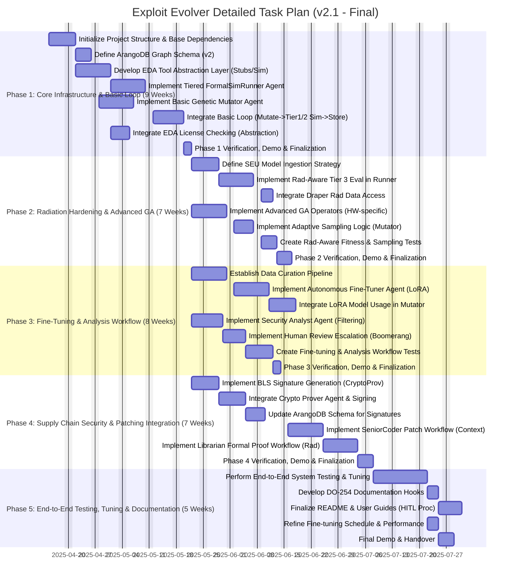

# Objective: Autonomous Hardware Exploit Evolution System

Develop an MCP-compatible, on-premises agentic system (**draper-mcp-exploit-evolver**) as an R&D project. This system will perform continuous, adaptive discovery and analysis of vulnerabilities in Draper's radiation-hardened microelectronics. It functions as an AI assistant to security teams, automating exploit exploration using advanced Genetic Algorithms (GA) enhanced by autonomous LoRA fine-tuning. The system employs tiered fitness evaluation (integrating simulation and formal methods with SEU models), stores findings in a knowledge graph (ArangoDB), provides cryptographic proof of exploit lineage (BLS Signatures), and incorporates human-in-the-loop oversight for critical finding analysis and patch initiation.

# Core Components:

*   **Agentic Workflow (MCP):** Orchestrated by `Boomerang`, coordinating specialized agents (`Planner`, `RTLIntrospector`, `ExploitMutator`, `FormalSimRunner`, `CryptoProver`, `SecurityAnalyst`, `SeniorCoder-HW`, `Librarian-Formal-Verify`, `AutonomousFineTuner`). Includes mandatory Human-in-the-Loop steps.
*   **Exploit Mutator Engine:** Advanced GA (island models, novelty search) with hardware-specific operators. Guided by LoRA models fine-tuned on historical and generated data. Implements adaptive sampling for evaluation requests.
*   **Tiered Fitness Evaluation:** Multi-stage pipeline (`FormalSimRunner` agent):
    1.  Fast Heuristics/Static Checks.
    2.  Behavioral RTL Simulation.
    3.  High-Fidelity Rad-Aware Simulation (GLS w/ SEU) / Formal Property Checks.
*   **Knowledge Graph:** ArangoDB storing vulnerabilities, exploits, patches, proofs, fitness records, and lineage.
*   **Autonomous Fine-Tuning:** Dedicated agent (`AutonomousFineTuner`) managing data curation and LoRA model training during low-usage periods.
*   **EDA Tool Abstraction Layer:** Python library wrapping interactions with EDA tools (simulators, formal tools) and license management checks.
*   **Security & Patching Workflow:** Includes cryptographic signing (`CryptoProver`), AI-assisted analysis (`SecurityAnalyst`), human review hooks, contextualized patch development (`SeniorCoder-HW`), and rad-aware formal patch verification (`Librarian-Formal-Verify`).
*   **Radiation Awareness:** Integration of Draper SEU models into fitness evaluation (Tier 3) and patch verification.
*   **Packaging & Deployment:** Designed for secure on-premises deployment using Docker containers, managed via `docker-compose.yml`, Python packaging via `pyproject.toml` / `uv`. Requires GPU resources (H100 recommended).

# Recovery Plan (If Session Crashes):

1.  **Identify Last Completed Task:** Review this task plan document (`taskplan.md`) for the last task marked `[X]`.
2.  **Identify Next Task:** Resume development at the first task marked `[ ]`.
3.  **Restart Process:** Relaunch the development environment. Ensure Docker containers (`docker compose up -d`) for dependencies like ArangoDB are running if needed. Relaunch the MCP agent framework.
4.  **Continue Development:** Instruct the `Planner` agent to proceed with the next identified task.

---

# Task Plan Visualization



---

# Final Task Plan: draper-mcp-exploit-evolver Development

**Phase 1: Core Infrastructure & Basic Loop**

*   [ ] **Task 1.1: Initialize Project Structure & Base Dependencies**
    *   Action: Create directory structure (`src/draper_exploit_evolver`, `scripts`, `repo_docs`, `src/draper_exploit_evolver/docs`). Initialize `pyproject.toml` (using `uv`), `.gitignore`. Add core dependencies (e.g., `fastapi` for potential agent interfaces, `arango`, `mcp-core`, base ML libs). Setup secure environment prerequisites (Docker, CUDA for H100s). Install ArangoDB. Create placeholder `lessons_learned.json`.
    *   Deliverable: Project directory structure, `pyproject.toml`, `uv.lock`, `.gitignore`, `lessons_learned.json`, base environment confirmed functional.
*   [ ] **Task 1.2: Define ArangoDB Graph Schema (v2)**
    *   Action: Design and document the graph schema in ArangoDB. Define collections (e.g., `Exploits`, `Vulnerabilities`, `Patches`, `Proofs`, `DesignComponents`, `FitnessRecords`) and edge collections (e.g., `TARGETS`, `MUTATED_FROM`, `EVALUATES`, `FIXES`, `VERIFIES`, `AFFECTS`). Include fields for lineage, signatures, fitness scores, SEU parameters, timestamps.
    *   Deliverable: Schema documentation (e.g., markdown file or script), ArangoDB collections created.
*   [ ] **Task 1.3: Develop EDA Tool Abstraction Layer (Stubs/Sim)**
    *   Action: Create a Python module (`src/draper_exploit_evolver/eda_abstraction.py`). Define classes/functions to wrap interactions with EDA tools. Implement initial functionality for basic simulation (e.g., wrapping `vcs` or `questa` command-line execution) and license checking (stub function initially). Formal tool interaction can be stubbed.
    *   Deliverable: `eda_abstraction.py` module with initial simulation wrapper and license check stub.
*   [ ] **Task 1.4: Implement Tiered FormalSimRunner Agent**
    *   Action: Create the `.roomodes` definition for `FormalSimRunner`. Implement the agent's Python code. Logic should accept evaluation requests (Tier 1/2/3), parameters, and design info. Use the `eda_abstraction.py` module (Task 1.3) to execute the requested task (initially focus on Tier 1 heuristics/lint, Tier 2 behavioral sim). Parse results via abstraction layer.
    *   Deliverable: `formal_sim_runner.py` agent code, `formal-sim-runner` roomode definition.
*   [ ] **Task 1.5: Implement Basic Genetic Mutator Agent**
    *   Action: Create the `.roomodes` definition for `ExploitMutator`. Implement the agent's Python code. Include basic GA loop (selection, simple mutation operators like testbench input fuzzing), population management. Logic to request Tier 1/2 evaluations via `Boomerang` (who calls `FormalSimRunner`). No LoRA/adaptive sampling yet.
    *   Deliverable: `exploit_mutator.py` agent code, `exploit-mutator` roomode definition.
*   [ ] **Task 1.6: Integrate Basic Loop (Mutate->Tier1/2 Sim->Store)**
    *   Action: Implement/refine the `Boomerang` agent's orchestration logic to manage the core loop: `Planner` tasks `Boomerang`, `Boomerang` tasks `Mutator`, `Mutator` requests eval, `Boomerang` tasks `FormalSimRunner` (Tier 1/2), `FormalSimRunner` returns result, `Boomerang`/`Mutator` stores key findings/fitness in ArangoDB (using basic write functions/API).
    *   Deliverable: Functional basic workflow demonstrating agent communication and data flow for Tier 1/2 evaluations and DB storage. Updated `Boomerang` agent code.
*   [ ] **Task 1.7: Integrate EDA License Checking (Abstraction)**
    *   Action: Implement the actual license checking logic within `eda_abstraction.py` (e.g., calling `lmstat`, parsing output, or using a vendor API if available). Update `Boomerang` agent logic to call the abstraction layer's check before dispatching Tier 2/3 jobs to `FormalSimRunner` and implement basic queuing/delay if unavailable.
    *   Deliverable: Updated `eda_abstraction.py` with license check function. Updated `Boomerang` agent with license check call and queuing logic.
*   [ ] **Task 1.8: Phase 1 Verification, Demo & Finalization**
    *   **Goal:** Verify core infrastructure setup, agent communication, basic GA loop (Tier 1/2 eval), DB storage, and EDA abstraction layer (sim + license stub).
    *   **Actions:** Review code artifacts, run basic test case through the integrated loop, demonstrate agent interactions via logs/MCP UI, show data storage in ArangoDB, `git add .`, `git commit -m "Complete Phase 1: Core Infrastructure & Basic Loop"`, `git tag v0.1-coreloop`, potentially update lessons learned.
    *   **Deliverable:**
        *   Project structure and dependencies initialized.
        *   ArangoDB schema defined and implemented.
        *   EDA Abstraction layer created with basic simulation and license checking.
        *   `FormalSimRunner` and `ExploitMutator` agents created with basic functionality.
        *   Integrated loop confirmed working for Tier 1/2 evals and DB storage.
        *   Demo showcasing the basic workflow execution.

---

**Phase 2: Radiation Hardening & Advanced GA**

*   [ ] **Task 2.1: Define SEU Model Ingestion Strategy**
    *   Action: Based on feedback/information from Draper, analyze the format of their SEU models. Design the strategy for how agents (`FormalSimRunner`, `Librarian`, potentially `Mutator`) will access and interpret this data (e.g., parsing specific file formats, querying an internal API/database, using pre-defined parameter sets).
    *   Deliverable: Design document outlining SEU model access and interpretation strategy. Code stubs/interfaces for SEU data access.
*   [ ] **Task 2.2: Implement Rad-Aware Tier 3 Eval in Runner**
    *   Action: Extend the `FormalSimRunner` agent and the `eda_abstraction.py` module to handle Tier 3 evaluations (GLS and/or Formal). Implement logic to inject SEU effects into simulation testbenches or formal properties based on the strategy defined in Task 2.1.
    *   Deliverable: Updated `FormalSimRunner` agent code. Updated `eda_abstraction.py` with Tier 3 execution and SEU injection capabilities.
*   [ ] **Task 2.3: Integrate Draper Rad Data Access**
    *   Action: Implement the actual code to fetch/load/use the Draper SEU model data within the agents/abstraction layer, according to the strategy from Task 2.1.
    *   Deliverable: Functional integration allowing SEU parameters to be used during Tier 3 evaluations.
*   [ ] **Task 2.4: Implement Advanced GA Operators (HW-specific)**
    *   Action: Enhance the `ExploitMutator` agent by adding more sophisticated, hardware-aware mutation operators (e.g., structural HDL modifications, bus protocol error injection, timing constraint fuzzing, FSM state/transition manipulation).
    *   Deliverable: Updated `ExploitMutator` agent code with new mutation functions.
*   [ ] **Task 2.5: Implement Adaptive Sampling Logic (Mutator)**
    *   Action: Implement an adaptive sampling algorithm (e.g., Multi-Armed Bandit like UCB1) within the `ExploitMutator` agent. This logic will decide whether to escalate promising variants (that pass Tier 1) to Tier 2 or Tier 3 evaluation based on exploration/exploitation trade-offs informed by previous evaluation results within the current run.
    *   Deliverable: Updated `ExploitMutator` agent code incorporating adaptive sampling for evaluation requests.
*   [ ] **Task 2.6: Create Rad-Aware Fitness & Sampling Tests**
    *   Action: Develop specific test scripts and scenarios (`scripts/test_rad_ga.py`) to verify the correct functioning of Tier 3 rad-aware evaluations and the adaptive sampling logic. Use small benchmark designs or mockups.
    *   Deliverable: Test scripts and documented results confirming rad-aware evaluation and sampling behavior.
*   [ ] **Task 2.7: Phase 2 Verification, Demo & Finalization**
    *   **Goal:** Verify radiation-aware Tier 3 evaluation, advanced GA operators, and adaptive sampling mechanism.
    *   **Actions:** Review code/tests, demonstrate rad-aware GLS/Formal run triggered by GA, show adaptive sampling decisions in logs, execute `test_rad_ga.py`, `git add .`, `git commit -m "Complete Phase 2: Rad-Hardening & Advanced GA"`, `git tag v0.2-radga`, potentially update lessons learned.
    *   **Deliverable:**
        *   SEU model ingestion strategy defined.
        *   Tier 3 Rad-Aware evaluation capability implemented in `FormalSimRunner` / Abstraction Layer.
        *   Advanced GA operators added to `ExploitMutator`.
        *   Adaptive sampling logic implemented in `ExploitMutator`.
        *   Tests confirming functionality created and passed.
        *   Demo showcasing rad-aware evaluation and adaptive sampling.

---

**Phase 3: Fine-Tuning & Analysis Workflow**

*   [ ] **Task 3.1: Establish Data Curation Pipeline**
    *   Action: Define and script the process for collecting and formatting training data for LoRA fine-tuning. This involves querying ArangoDB for generated exploit data (variants, operators, success/failure) and integrating pre-processed historical Draper data (based on Draper feedback on format/access).
    *   Deliverable: Data curation scripts (`scripts/curate_finetune_data.py`), documentation of the data format and pipeline.
*   [ ] **Task 3.2: Implement Autonomous Fine-Tuner Agent (LoRA)**
    *   Action: Create the `.roomodes` definition for `AutonomousFineTuner`. Implement the agent's Python code. Logic should trigger based on schedule/command, run the curation pipeline (Task 3.1), prepare and launch a fine-tuning job (using `unsloth`/`peft` via `command`), monitor completion, and store resulting LoRA weights.
    *   Deliverable: `autonomous_fine_tuner.py` agent code, `autonomous-fine-tuner` roomode definition, fine-tuning run scripts.
*   [ ] **Task 3.3: Integrate LoRA Model Usage in Mutator**
    *   Action: Modify the `ExploitMutator` agent to load the latest available LoRA weights (path provided by `Boomerang`/config) and use the fine-tuned model during the GA operator selection step to guide the mutation strategy.
    *   Deliverable: Updated `ExploitMutator` agent code capable of using LoRA guidance.
*   [ ] **Task 3.4: Implement Security Analyst Agent (Filtering)**
    *   Action: Create the `.roomodes` definition for `SecurityAnalyst`. Implement the agent's Python code. Logic should query ArangoDB for high-impact findings, apply analysis heuristics (correlate, check specs if possible), assign confidence scores, and identify findings needing human review.
    *   Deliverable: `security_analyst.py` agent code, `security-analyst` roomode definition.
*   [ ] **Task 3.5: Implement Human Review Escalation (Boomerang)**
    *   Action: Enhance the `Boomerang` agent's orchestration logic. After receiving the analysis report from `SecurityAnalyst`, check for items flagged for human review. If flagged, use the `ask_human` tool via MCP, providing the analyst's report and context. Pause the relevant workflow branch (e.g., patching) until human feedback is received via `Planner`.
    *   Deliverable: Updated `Boomerang` agent code with HITL escalation logic.
*   [ ] **Task 3.6: Create Fine-tuning & Analysis Workflow Tests**
    *   Action: Develop test scripts (`scripts/test_learning_analysis.py`) to verify the fine-tuning pipeline (data curation -> tuning job launch -> model usage) and the analysis workflow (Analyst agent processing -> HITL escalation trigger).
    *   Deliverable: Test scripts and documented results confirming the learning loop and analysis/HITL workflow steps.
*   [ ] **Task 3.7: Phase 3 Verification, Demo & Finalization**
    *   **Goal:** Verify the autonomous fine-tuning loop and the analysis workflow including human review escalation.
    *   **Actions:** Review code/tests, demonstrate a fine-tuning job being launched, show Mutator using LoRA guidance (if feasible in demo), demonstrate Analyst agent filtering findings and Boomerang triggering `ask_human`, execute tests, `git add .`, `git commit -m "Complete Phase 3: Fine-Tuning & Analysis"`, `git tag v0.3-learning`, potentially update lessons learned.
    *   **Deliverable:**
        *   Data curation pipeline established.
        *   `AutonomousFineTuner` agent implemented.
        *   `ExploitMutator` integrated with LoRA model usage.
        *   `SecurityAnalyst` agent implemented.
        *   Human review escalation implemented in `Boomerang`.
        *   Tests confirming workflows created and passed.
        *   Demo showcasing fine-tuning trigger and analysis/HITL flow.

---

**Phase 4: Supply Chain Security & Patching Integration**

*   [ ] **Task 4.1: Implement BLS Signature Generation (CryptoProv)**
    *   Action: Create the `.roomodes` definition for `CryptoProver`. Implement the agent's Python code using a suitable BLS signature library (e.g., `py_ecc`). Logic should accept data payload (exploit hash, lineage) and generate a signature. Handle key management securely (passed via context or secure store).
    *   Deliverable: `crypto_prover.py` agent code, `crypto-prover` roomode definition.
*   [ ] **Task 4.2: Integrate Crypto Prover Agent & Signing**
    *   Action: Modify the `Boomerang` agent. After storing a significant exploit finding in ArangoDB, `Boomerang` should gather the required data (hash, parent info) and task the `CryptoProver` agent to generate the signature.
    *   Deliverable: Updated `Boomerang` agent code integrating calls to `CryptoProver`.
*   [ ] **Task 4.3: Update ArangoDB Schema for Signatures**
    *   Action: Modify the ArangoDB schema (Task 1.2) and data storage logic to include fields for storing the generated BLS signatures alongside exploit/lineage records.
    *   Deliverable: Updated ArangoDB schema documentation/scripts. Updated DB interaction code.
*   [ ] **Task 4.4: Implement SeniorCoder Patch Workflow (Context)**
    *   Action: Create the `.roomodes` definition for `SeniorCoder-HW`. Implement the agent's Python code. Logic should parse the detailed context provided by `Boomerang` (exploit vector, CEX, code pointers), attempt to generate an HDL patch, and perform basic lint checks via the `eda_abstraction.py`.
    *   Deliverable: `senior_coder_hw.py` agent code, `senior-coder-hw` roomode definition. Robust context passing implemented in `Boomerang`.
*   [ ] **Task 4.5: Implement Librarian Formal Proof Workflow (Rad)**
    *   Action: Create the `.roomodes` definition for `Librarian-Formal-Verify`. Implement the agent's Python code. Logic should receive patch details, generate rad-aware SVA properties to verify the fix, and task `Boomerang` to run formal verification via `FormalSimRunner` (Tier 3 Formal mode). Parse results.
    *   Deliverable: `librarian_formal_verify.py` agent code, `librarian-formal-verify` roomode definition.
*   [ ] **Task 4.6: Phase 4 Verification, Demo & Finalization**
    *   **Goal:** Verify the cryptographic signing, contextualized patching attempt, and rad-aware patch verification loop.
    *   **Actions:** Review code, demonstrate an exploit being signed, show `SeniorCoder-HW` receiving context and attempting a patch, demonstrate `Librarian` generating SVA and triggering formal verification of the patch, `git add .`, `git commit -m "Complete Phase 4: Security & Patching"`, `git tag v0.4-patching`, potentially update lessons learned.
    *   **Deliverable:**
        *   `CryptoProver` agent implemented and integrated.
        *   ArangoDB schema updated for signatures.
        *   `SeniorCoder-HW` agent implemented with context handling.
        *   `Librarian-Formal-Verify` agent implemented.
        *   Demo showcasing signing and patch generation/verification flow.

---

**Phase 5: End-to-End Testing, Tuning & Documentation**

*   [ ] **Task 5.1: Perform End-to-End System Testing & Tuning**
    *   Action: Develop and execute comprehensive end-to-end test scenarios (`scripts/test_e2e.py`) using representative (potentially simplified) target designs. Test the full workflow from exploit evolution through analysis, HITL, patching, and verification. Identify bottlenecks and tune GA parameters, sampling strategies, and agent interactions.
    *   Deliverable: Comprehensive E2E test suite, documented test results, performance tuning report/adjustments.
*   [ ] **Task 5.2: Develop DO-254 Documentation Hooks**
    *   Action: Review the system's outputs (ArangoDB records, agent reports, logs). Implement functions or modify reporting logic to automatically format or tag key artifacts (e.g., verified vulnerability reports, patch proofs with traceability links) in a way that facilitates their use as evidence for DO-254 objectives.
    *   Deliverable: Updated reporting/logging mechanisms generating DO-254 relevant artifact summaries or pointers.
*   [ ] **Task 5.3: Finalize README & User Guides (HITL Proc)**
    *   Action: Update the main `README.md` to reflect the final system architecture and capabilities. Create concise user guides explaining how to run the system, configure it, and importantly, how verification engineers interact with the Human-in-the-Loop prompts.
    *   Deliverable: Finalized `README.md`, User Guide document(s).
*   [ ] **Task 5.4: Refine Fine-tuning Schedule & Performance**
    *   Action: Based on E2E testing and usage patterns, optimize the scheduling and resource allocation for the `AutonomousFineTuner` agent. Refine data curation rules if necessary.
    *   Deliverable: Optimized configuration/logic for the fine-tuning process.
*   [ ] **Task 5.5: Final Demo & Handover**
    *   **Goal:** Demonstrate the fully integrated system operating on a representative example, showcasing the R&D achievements and potential. Handover documentation and codebase.
    *   **Actions:** Prepare final demo scenario, present results of E2E testing and tuning, walk through documentation, perform final code commit (`git add .`, `git commit -m "Complete Phase 5: Final E2E Testing & Documentation"`, `git tag v1.0-final`), potentially update lessons learned.
    *   **Deliverable:** Successful final demonstration, completed documentation, final tagged codebase.

```

