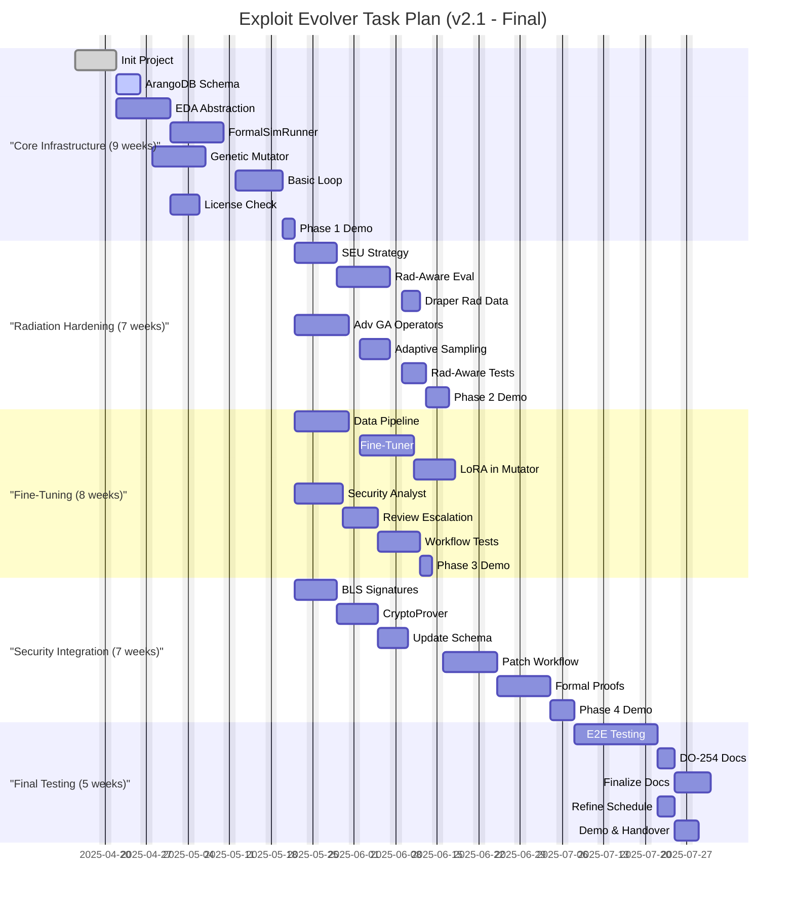

# 🎯 Objective: Autonomous Hardware Exploit Evolution System

> **Note:** On-premises deployment significantly aids ITAR compliance by keeping data internal. Full compliance requires additional organizational controls (access restrictions, audits, training, documentation).

---

Develop an MCP-compatible, on-premises agentic R&D system (**draper-mcp-exploit-evolver**) for continuous, adaptive discovery and analysis of vulnerabilities in Draper's radiation-hardened microelectronics. The system automates exploit evolution using advanced genetic algorithms (GAs) guided by LoRA fine-tuning, integrates SEU-aware tiered evaluation, stores findings in a knowledge graph, provides cryptographic lineage proofs, and incorporates human oversight for critical decisions and patching.

---

## 🏗️ Core Components

- **🤖 Agentic Workflow (MCP):**  
  Orchestrated by `Boomerang`, coordinating specialized agents:  
  `Planner`, `RTLIntrospector`, `ExploitMutator`, `FormalSimRunner`, `CryptoProver`, `SecurityAnalyst`, `SeniorCoder-HW`, `Librarian-Formal-Verify`, `AutonomousFineTuner`.  
  Includes mandatory human-in-the-loop steps.

- **🧬 Exploit Mutator Engine:**  
  Advanced GA with hardware-specific mutation operators, guided by continuously fine-tuned LoRA models trained on Draper data and system discoveries. Implements adaptive sampling to optimize evaluation.

- **📊 Tiered Fitness Evaluation:**  
  Multi-stage pipeline via `FormalSimRunner`:  
  1. ⚡ Fast heuristics and static checks  
  2. 🖥️ Behavioral RTL simulation  
  3. ☢️ High-fidelity, radiation-aware GLS and formal verification with SEU fault injection

- **🗂️ Knowledge Graph:**  
  ArangoDB storing vulnerabilities, exploits, patches, proofs, fitness records, and cryptographic lineage.

- **🧠 Autonomous Fine-Tuning:**  
  `AutonomousFineTuner` agent manages data curation and LoRA model updates during low-usage periods.

- **🛠️ EDA Tool Abstraction Layer:**  
  Python library wrapping EDA tool interactions (simulators, formal tools) and license management.

- **🔒 Security & Patching Workflow:**  
  Cryptographic signing (`CryptoProver`), AI-assisted analysis (`SecurityAnalyst`), human review, contextualized patching (`SeniorCoder-HW`), and rad-aware formal patch verification (`Librarian-Formal-Verify`).

- **☢️ Radiation Awareness:**  
  Integration of Draper SEU models into exploit evaluation and patch verification.

- **📦 Packaging & Deployment:**  
  Secure on-premises deployment via Docker and `uv`, requiring GPU resources (H100 recommended).

---

## 🔄 Recovery Plan (If Session Crashes)

1. 🔍 Review `taskplan.md` for the last completed task `[X]`.
2. ▶️ Resume at the first incomplete task `[ ]`.
3. 🚀 Relaunch environment and dependencies (`docker compose up -d`), restart MCP agents.
4. 📝 Instruct `Planner` to continue.

---

## 📅 Task Plan Visualization

*(See `taskplan.md` for detailed Gantt chart)*

---

## 📝 Final Notes

- 🔄 The system leverages **LoRA fine-tuning** to continuously improve GA exploit evolution.
- 🔐 **BLS signatures** provide compact, verifiable exploit lineage.
- ☢️ **SEU models** are integrated into both exploit evaluation and patch verification.
- 👥 **Human-in-the-loop** oversight ensures safety and compliance.
- 🏢 Designed for **secure, on-premises deployment** with scalable GPU acceleration.

---

## 🔒 Security Implementation Checklist

### Access Control
- Enforce strict RBAC and ABAC policies for all agents, developers, and reviewers.
- Remove or disable all default accounts in ArangoDB, Docker, and internal services.
- Prohibit shared credentials; assign unique, auditable identities to each user and agent.
- Segment exploit data, cryptographic keys, and credentials into isolated database schemas.
- Continuously audit access logs and monitor for anomalous activities.

### Key Management
- Store BLS keys and secrets in HSMs or secure vaults.
- Automate key rotation schedules.
- Restrict key access to CryptoProver and authorized admins only.
- Separate key management duties from exploit development roles.
- Log all key lifecycle events.

### Audit Trails
- Centralize encrypted, immutable logs of agent actions, exploit mutations, signing, and reviews.
- Include timestamps, user/agent IDs, and event types.
- Enable alerts on suspicious activities.
- Require MFA or certificates for log access.
- Review logs regularly.

### Insider Threats
- Use behavioral analytics to detect anomalous user/agent behavior.
- Enforce least privilege across all roles.
- Conduct insider threat training.
- Perform periodic risk assessments.
- Establish an insider threat response team.

### Recovery Plan Security
- Protect backups and recovery images with cryptographic checksums.
- Require MFA for recovery operations.
- Isolate recovery infrastructure from operational networks.
- Test recovery procedures regularly.
- Log all recovery actions.

### Social Engineering Defense
- Maintain incident response playbooks for phishing and impersonation.
- Conduct phishing simulations.
- Implement email filtering, URL inspection, and attachment sandboxing.
- Use social engineering testing tools.
- Integrate social engineering defense into training.
