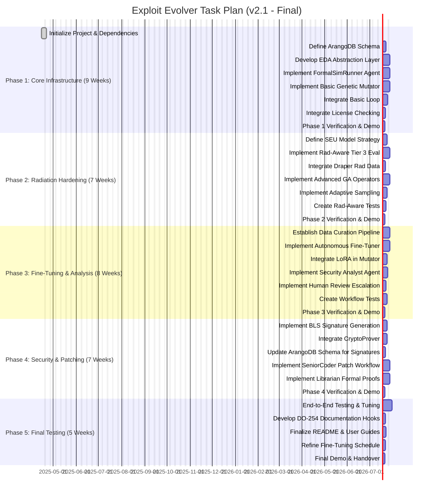

# Objective: Autonomous Hardware Exploit Evolution System

Develop an MCP-compatible, on-premises agentic R&D system (**draper-mcp-exploit-evolver**) for continuous, adaptive discovery and analysis of vulnerabilities in Draper's radiation-hardened microelectronics. The system automates exploit evolution using advanced genetic algorithms (GAs) guided by LoRA fine-tuning, integrates SEU-aware tiered evaluation, stores findings in a knowledge graph, provides cryptographic lineage proofs, and incorporates human oversight for critical decisions and patching.

---

# Core Components

- **Agentic Workflow (MCP):**  
  Orchestrated by `Boomerang`, coordinating specialized agents:  
  `Planner`, `RTLIntrospector`, `ExploitMutator`, `FormalSimRunner`, `CryptoProver`, `SecurityAnalyst`, `SeniorCoder-HW`, `Librarian-Formal-Verify`, `AutonomousFineTuner`.  
  Includes mandatory human-in-the-loop steps.

- **Exploit Mutator Engine:**  
  Advanced GA with hardware-specific mutation operators, guided by continuously fine-tuned LoRA models trained on Draper data and system discoveries. Implements adaptive sampling to optimize evaluation.

- **Tiered Fitness Evaluation:**  
  Multi-stage pipeline via `FormalSimRunner`:  
  1. Fast heuristics and static checks  
  2. Behavioral RTL simulation  
  3. High-fidelity, radiation-aware GLS and formal verification with SEU fault injection

- **Knowledge Graph:**  
  ArangoDB storing vulnerabilities, exploits, patches, proofs, fitness records, and cryptographic lineage.

- **Autonomous Fine-Tuning:**  
  `AutonomousFineTuner` agent manages data curation and LoRA model updates during low-usage periods.

- **EDA Tool Abstraction Layer:**  
  Python library wrapping EDA tool interactions (simulators, formal tools) and license management.

- **Security & Patching Workflow:**  
  Cryptographic signing (`CryptoProver`), AI-assisted analysis (`SecurityAnalyst`), human review, contextualized patching (`SeniorCoder-HW`), and rad-aware formal patch verification (`Librarian-Formal-Verify`).

- **Radiation Awareness:**  
  Integration of Draper SEU models into exploit evaluation and patch verification.

- **Packaging & Deployment:**  
  Secure on-premises deployment via Docker and `uv`, requiring GPU resources (H100 recommended).

---

# Recovery Plan (If Session Crashes)

1. Review `taskplan.md` for the last completed task `[X]`.
2. Resume at the first incomplete task `[ ]`.
3. Relaunch environment and dependencies (`docker compose up -d`), restart MCP agents.
4. Instruct `Planner` to continue.

---

# Task Plan Visualization

*(See `taskplan.md` for detailed Gantt chart)*

---

# Final Notes

- The system leverages **LoRA fine-tuning** to continuously improve GA exploit evolution.
- **BLS signatures** provide compact, verifiable exploit lineage.
- **SEU models** are integrated into both exploit evaluation and patch verification.
- **Human-in-the-loop** oversight ensures safety and compliance.
- Designed for **secure, on-premises deployment** with scalable GPU acceleration.
