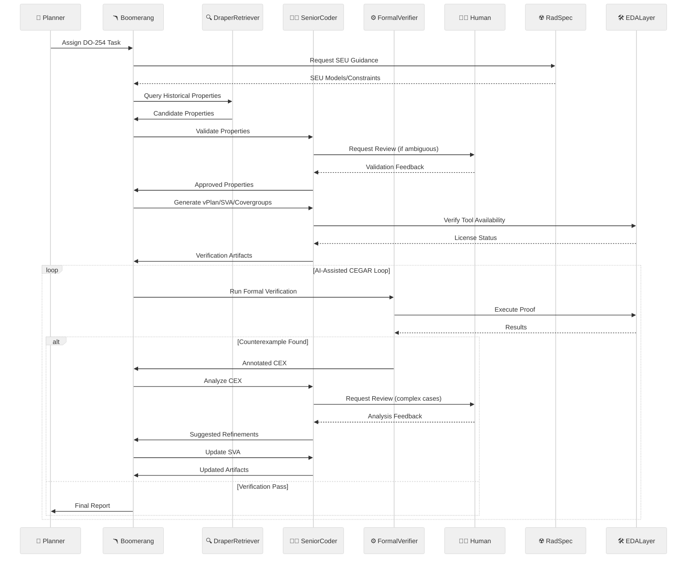

# 🧠 AI-Driven Formal Verification Planner for DO-254 (v2.1 - Final)

## 📑 Table of Contents
- [Abstract](#abstract)
- [Key Features](#key-features)
- [Workflow & Architecture](#workflow--architecture)
- [Implementation Strategy](#implementation-strategy)
- [Feasibility Report](#feasibility-report)
- [Deployment Strategy](#deployment-strategy)
- [Key Assumptions & Questions](#key-assumptions--questions)
- [Success Metrics](#success-metrics)

---

## 📜 Abstract
An MCP-integrated, on-premises agentic R&D system designed to accelerate and improve the rigor of DO-254 formal verification for Draper's radiation-hardened hardware.

**🔑 Core Value Proposition:**

- 🤖 Automates labor-intensive verification tasks with human oversight
- 🗃️ Leverages Draper's historical verification data via `MCPDocumentRetriever`
- ☢️ Integrates SEU radiation fault models through an EDA abstraction layer
- 🧠 Implements AI-assisted Counterexample-Guided Abstraction Refinement (CEGAR)
- 📄 Generates certification-ready artifacts supporting DO-254 compliance

---

## ✨ Key Features

### 🔍 Curated Cross-Project Assertion Reuse
- `DraperRetriever` agent queries a curated vector database of historical properties
- 👥 Human validation integrated into the workflow

### ⚙️ Abstracted & Radiation-Aware Formal Verification
- 🛠️ EDA abstraction layer (initially Synopsys VC Formal)
- ☢️ Incorporates SEU models into SystemVerilog Assertion (SVA) generation and analysis

### 📄 Intelligent Artifact Generation
- 🤖 Automated generation of verification plans (vPlans), SVAs, and covergroups
- 📜 Aligns with DO-254 certification objectives

### 🔄 AI-Enhanced CEGAR with Human Oversight
- 🧠 AI assists in abstraction, counterexample analysis, and refinement
- 👥 Human review for complex or ambiguous counterexamples ensures certification rigor

### ⚡ Integrated Resource Management
- 🔑 EDA license management integration
- ⏱️ Efficient job queuing and scheduling

### 👥 Human-in-the-Loop by Design
- ✅ Critical steps require human approval
- ✍️ Final sign-off by verification engineers

---

## 🔄 Workflow & Architecture

### 🔄 Workflow Summary

1. **📌 Tasking & Retrieval**  
   - Planner assigns task  
   - System retrieves and validates historical properties

2. **📄 Artifact Generation**  
   - Automated vPlan, SVA, and covergroup generation  
   - Incorporates SEU-aware constraints

3. **🔄 Verification Loop**  
   - License-aware job scheduling  
   - AI-assisted CEGAR with human review of complex cases

4. **✅ Completion**  
   - Coverage goal verification  
   - Final report generation

---

