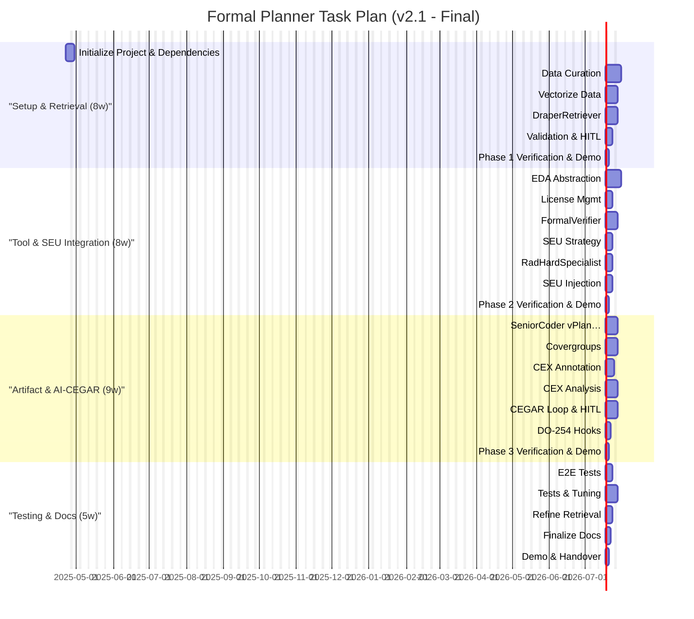

This project leverages intelligent autonomous agents to enhance the security, adaptability, and efficiency of complex software systems. These agents collaborate to identify vulnerabilities, plan secure operations, and dynamically respond to evolving threats. By integrating advanced reasoning and formal verification, the framework aims to provide robust, scalable solutions accessible to both technical experts and semi-technical stakeholders, ensuring clarity, transparency, and trust in automated decision-making.

# 🧠 AI-Driven Formal Verification Planner for DO-254

> **Note:** On-premises deployment significantly aids ITAR compliance by keeping data internal. Full compliance requires additional organizational controls (access restrictions, audits, training, documentation).

---

## 📜 Abstract

Develop an MCP-compatible, on-premises agentic R&D system (**draper-mcp-formal-planner**) to accelerate and enhance DO-254 formal verification of Draper's radiation-hardened hardware. The system leverages curated historical data, integrates SEU models, automates artifact generation, assists in AI-driven CEGAR loops, and incorporates human oversight for critical decisions.

---

## 🔑 Core Components

- **🤖 Agentic Workflow (MCP):**  
  Orchestrated by `Boomerang`, coordinating:  
  `Planner`, `DraperRetriever`, `SeniorCoder-Formal`, `FormalVerifier`, `RadHardSpecialist`.  
  Includes mandatory human-in-the-loop steps for property validation and complex counterexample analysis.

- **🔍 Curated Data Retriever:**  
  `DraperRetriever` agent queries a vector database of curated historical verification assets. Requires initial data curation.

- **🛠️ EDA Tool Abstraction Layer:**  
  Python library wrapping formal tool interactions (initially VC Formal) and license management.

- **📄 Artifact Generation:**  
  `SeniorCoder-Formal` generates vPlans, SEU-aware SVAs, and covergroups aligned with DO-254 objectives.

- **🔄 AI-Assisted CEGAR:**  
  `FormalVerifier` runs proofs and annotates counterexamples.  
  `SeniorCoder-Formal` analyzes annotated CEX, suggests refinements, escalates complex cases for human review.

- **☢️ Radiation Awareness:**  
  `RadHardSpecialist` integrates Draper SEU models into property generation and analysis.

- **⚡ Resource Management:**  
  `Boomerang` manages license checks and job queuing.

- **📦 Packaging & Deployment:**  
  Secure on-premises deployment via Docker and `uv`, requiring GPU resources (H100 recommended).

---

## 🔄 Recovery Plan (If Session Crashes)

1. 🔍 Review `taskplan.md` for last completed task `[X]`.
2. ▶️ Resume at the first incomplete task `[ ]`.
3. 🚀 Relaunch environment and dependencies (`docker compose up -d`), restart MCP agents.
4. 📝 Instruct `Planner` to continue.

---

## 📅 Task Plan Visualization

*(See `taskplan.md` for detailed Gantt chart)*

---

## 🗺️ Phase Legend

| Short Title                   | Full Description                                         |
|-------------------------------|----------------------------------------------------------|
| **Setup & Retrieval**         | Setup, Curation & Retrieval (8 Weeks)                   |
| **Tool & SEU Integration**    | Formal Tool Abstraction & SEU Integration (8 Weeks)     |
| **Artifact & AI-CEGAR**       | Artifact Generation & AI-Enhanced CEGAR (9 Weeks)       |
| **Testing & Docs**            | End-to-End Testing & Documentation (5 Weeks)            |

---

## 📝 Final Notes

- ☢️ Integrates **SEU models** into property generation and verification.
- 🔄 Uses **AI-assisted CEGAR** with human-in-the-loop review for certification rigor.
- 📄 Automates artifact generation aligned with DO-254.
- 🏢 Designed for **secure, on-premises deployment** with scalable GPU acceleration.

---

## 🔒 Security Implementation Guidelines

### Access Control
- Enforce RBAC and ABAC for all agents, verification data, and artifact repositories.
- Segment design data, verification results, and credentials into isolated database schemas.
- Remove default accounts in formal tools, databases, and internal services.
- Prohibit shared credentials; assign unique identities to each user and agent.
- Continuously audit access logs for unauthorized or anomalous activities.

### Key Management
- Store signing keys for verification artifacts in HSMs or secure vaults.
- Automate key rotation with minimal manual intervention.
- Enforce least privilege on key access; only authorized signing agents and admins can access keys.
- Separate key management duties from verification and development roles.
- Track full key lifecycle events (creation, rotation, revocation, destruction).

### Audit Trails
- Centralize immutable, encrypted logs of agent actions, verification runs, artifact signing, and human reviews.
- Include precise timestamps, user/agent IDs, and event types.
- Enable alerts on suspicious activities or policy violations.
- Require MFA or certificates for log access.
- Regularly review audit trails for compliance and incident response.

### Insider Threats
- Use behavioral analytics to detect anomalous user or agent behavior.
- Enforce least privilege across all roles, minimizing access to sensitive design data.
- Conduct regular insider threat training and awareness.
- Perform periodic risk assessments targeting privileged users and critical workflows.
- Establish a dedicated insider threat response team.

### Recovery Plan Security
- Protect recovery images, backups, and task state files with cryptographic checksums.
- Require MFA for initiating recovery or restore operations.
- Isolate recovery infrastructure from operational networks.
- Regularly test recovery procedures under adversarial conditions.
- Log all recovery actions with full auditability.

### Social Engineering Defense
- Maintain detailed incident response playbooks for phishing, pretexting, and impersonation.
- Conduct regular phishing simulations targeting all user roles.
- Implement advanced email filtering, URL inspection, and attachment sandboxing.
- Use social engineering testing tools to identify and remediate weaknesses.
- Integrate social engineering defense into ongoing security awareness training.