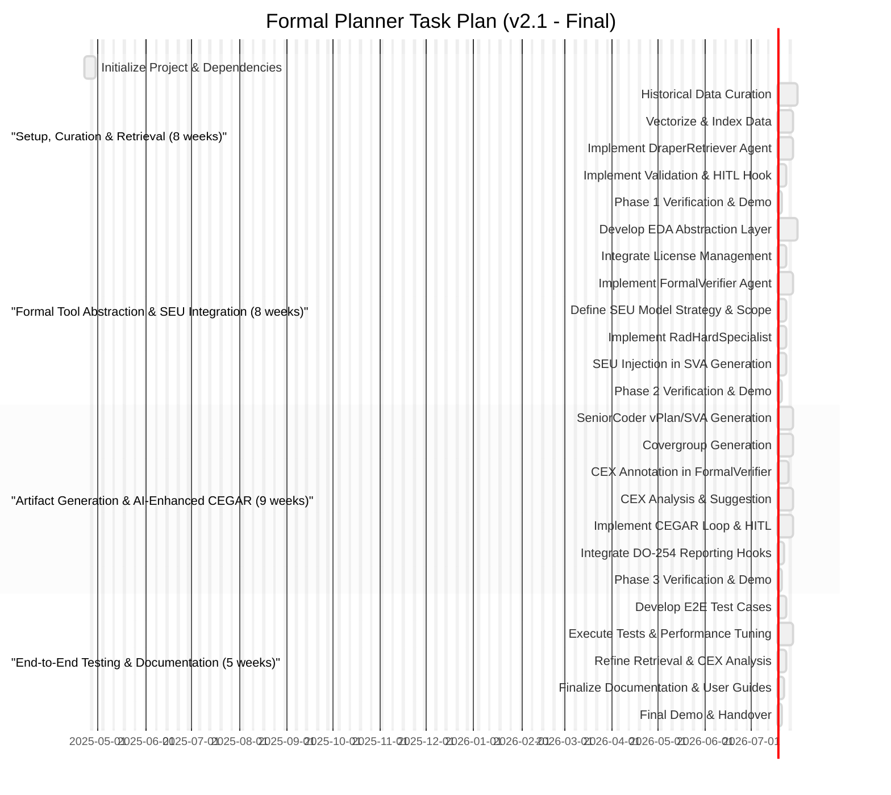

# 🧠 AI-Driven Formal Verification Planner for DO-254

> **Note:** On-premises deployment significantly aids ITAR compliance by keeping data internal. Full compliance requires additional organizational controls (access restrictions, audits, training, documentation).

---

## 📜 Abstract

Develop an MCP-compatible, on-premises agentic R&D system (**draper-mcp-formal-planner**) to accelerate and enhance DO-254 formal verification of Draper's radiation-hardened hardware. The system leverages curated historical data, integrates SEU models, automates artifact generation, assists in AI-driven CEGAR loops, and incorporates human oversight for critical decisions.

---

## 🔑 Core Components

- **🤖 Agentic Workflow (MCP):**  
  Orchestrated by `Boomerang`, coordinating:  
  `Planner`, `DraperRetriever`, `SeniorCoder-Formal`, `FormalVerifier`, `RadHardSpecialist`.  
  Includes mandatory human-in-the-loop steps for property validation and complex counterexample analysis.

- **🔍 Curated Data Retriever:**  
  `DraperRetriever` agent queries a vector database of curated historical verification assets. Requires initial data curation.

- **🛠️ EDA Tool Abstraction Layer:**  
  Python library wrapping formal tool interactions (initially VC Formal) and license management.

- **📄 Artifact Generation:**  
  `SeniorCoder-Formal` generates vPlans, SEU-aware SVAs, and covergroups aligned with DO-254 objectives.

- **🔄 AI-Assisted CEGAR:**  
  `FormalVerifier` runs proofs and annotates counterexamples.  
  `SeniorCoder-Formal` analyzes annotated CEX, suggests refinements, escalates complex cases for human review.

- **☢️ Radiation Awareness:**  
  `RadHardSpecialist` integrates Draper SEU models into property generation and analysis.

- **⚡ Resource Management:**  
  `Boomerang` manages license checks and job queuing.

- **📦 Packaging & Deployment:**  
  Secure on-premises deployment via Docker and `uv`, requiring GPU resources (H100 recommended).

---

## 🔄 Recovery Plan (If Session Crashes)

1. 🔍 Review `taskplan.md` for last completed task `[X]`.
2. ▶️ Resume at the first incomplete task `[ ]`.
3. 🚀 Relaunch environment and dependencies (`docker compose up -d`), restart MCP agents.
4. 📝 Instruct `Planner` to continue.

---

## 📅 Task Plan Visualization

*(See `taskplan.md` for detailed Gantt chart)*

---

## 🗺️ Phase Legend

| Short Title                   | Full Description                                         |
|-------------------------------|----------------------------------------------------------|
| **Setup & Retrieval**         | Setup, Curation & Retrieval (8 Weeks)                   |
| **Tool & SEU Integration**    | Formal Tool Abstraction & SEU Integration (8 Weeks)     |
| **Artifact & AI-CEGAR**       | Artifact Generation & AI-Enhanced CEGAR (9 Weeks)       |
| **Testing & Docs**            | End-to-End Testing & Documentation (5 Weeks)            |

---

## 📝 Final Notes

- ☢️ Integrates **SEU models** into property generation and verification.
- 🔄 Uses **AI-assisted CEGAR** with human-in-the-loop review for certification rigor.
- 📄 Automates artifact generation aligned with DO-254.
- 🏢 Designed for **secure, on-premises deployment** with scalable GPU acceleration.