# AI-Driven Formal Verification Planner for DO-254 📜🔍 (v2.1 - Final)

## Table of Contents
- [Abstract](#abstract)
- [Key Features](#key-features)
- [Workflow & Architecture](#workflow--architecture)
- [Implementation Strategy](#implementation-strategy)
- [Feasibility Report](#feasibility-report)
- [Deployment Strategy](#deployment-strategy)
- [Key Assumptions & Questions](#key-assumptions--questions)
- [Success Metrics](#success-metrics)

---

## Abstract
An MCP-integrated, on-premises agentic system **proposed as a Research & Development (R&D) initiative** designed to significantly accelerate and improve the rigor of the DO-254 formal verification process for Draper's radiation-hardened systems.

🔹 **Core Value Proposition**:
- Automates laborious verification tasks while ensuring human oversight
- Leverages Draper's historical verification data via `MCPDocumentRetriever`
- Integrates radiation fault models through **EDA Tool Abstraction Layer**
- Implements **AI-assisted Counterexample-Guided Refinement (CEGAR)**
- Generates certification-ready artifacts supporting DO-254 compliance

## Key Features
✅ **Curated Cross-Project Assertion Reuse**  
   - Specialized `DraperRetriever` queries curated vector database  
   - Human validation integrated into workflow  

✅ **Abstracted & Rad-Aware Formal Verification**  
   - EDA Tool Abstraction Layer (initially Synopsys VC Formal)  
   - Incorporates SEU models into SVA generation  

✅ **Intelligent Artifact Generation**  
   - Automated vPlans, SVA, and covergroups generation  
   - Aligned with DO-254 objectives  

✅ **AI-Enhanced CEGAR with Annotated CEX**  
   - Robust counterexample analysis loop  
   - Human review for complex cases  

✅ **Integrated Resource Management**  
   - EDA license management integration  
   - Efficient job queuing  

✅ **Human-in-the-Loop by Design**  
   - Critical steps require human approval  
   - Final sign-off by verification engineers  

---

## Workflow & Architecture

```mermaid
sequenceDiagram
    participant Planner as 📝 Planner
    participant Boomerang as 🪃 Boomerang
    participant Retriever as 🔍 DraperRetriever
    participant Coder as 👩‍💻 SeniorCoder
    participant Verifier as ⚙️ FormalVerifier
    participant Human as 🧑‍🔬 Human
    participant RadSpec as ☢️ RadSpec
    participant EDALayer as 🛠️ EDALayer

    Planner->>Boomerang: Assign DO-254 Task
    Boomerang->>RadSpec: Request SEU Guidance
    RadSpec-->>Boomerang: SEU Models/Constraints
    Boomerang->>Retriever: Query Historical Properties
    Retriever->>Boomerang: Candidate Properties
    Boomerang->>Coder: Validate Properties
    Coder->>Human: Request Review (if ambiguous)
    Human-->>Coder: Validation Feedback
    Coder->>Boomerang: Approved Properties
    
    Boomerang->>Coder: Generate vPlan/SVA/Covergroups
    Coder->>EDALayer: Verify Tool Availability
    EDALayer-->>Coder: License Status
    Coder->>Boomerang: Verification Artifacts
    
    loop CEGAR Verification Cycle
        Boomerang->>Verifier: Run Formal Verification
        Verifier->>EDALayer: Execute Proof
        EDALayer-->>Verifier: Results
        alt CEX Found
            Verifier->>Boomerang: Annotated CEX
            Boomerang->>Coder: Analyze CEX
            Coder->>Human: Request Review (complex cases)
            Human-->>Coder: Analysis Feedback
            Coder->>Boomerang: Suggested Refinements
            Boomerang->>Coder: Update SVA
            Coder->>Boomerang: Updated Verification Artifacts
        else Verification Pass
            Boomerang->>Planner: Final Report
        end
    end
```

### Workflow Explanation
1. **Tasking & Retrieval**  
   - Planner assigns verification task  
   - System retrieves relevant historical properties  
   - Human validation for ambiguous cases  

2. **Artifact Generation**  
   - Automated vPlan and SVA generation  
   - Radiation-aware verification setup  

3. **Verification Loop**  
   - License-aware job queuing  
   - Formal proof execution  
   - Annotated counterexample analysis  

4. **Completion**  
   - Coverage goal verification  
   - Final report generation  

---

## Implementation Strategy
📅 (See taskplan.md for detailed Gantt chart)

### Phased Approach:
1. **Core Architecture** (Weeks 1-4)  
   - MCP agent framework  
   - EDA abstraction layer  

2. **Data Integration** (Weeks 5-8)  
   - Historical data curation  
   - SEU model integration  

3. **Verification Automation** (Weeks 9-12)  
   - SVA generation  
   - CEGAR implementation  

4. **Validation & Refinement** (Weeks 13-16)  
   - Pilot testing  
   - Performance optimization  

---

## Feasibility Report
| Aspect                | Rating  | Notes |
|-----------------------|---------|-------|
| Technical Viability   | 8/10    | Requires robust engineering |
| ITAR Compliance       | 10/10   | On-prem deployment |
| Performance           | Moderate| Focus on engineer efficiency |
| Certification Impact  | 50-70%  | Potential effort reduction |
| R&D Focus            | High    | Exploration of AI assistance |
| Data Dependency       | Very High| Requires curated historical data |
| Integration Complexity| High    | Multiple system integrations |

---

## Deployment Strategy
### Primary Recommendation: On-Premises
- Maximum security for ITAR/sensitive IP  
- Simplified compliance  
- Direct EDA tool integration  

### Secondary Option: Google Cloud ITAR
- GCP Assured Workloads  
- Increased complexity and cost  

### Hardware Requirements
- **Initial**: 2x NVIDIA H100 GPUs  
- **Scalable**: Add 2-4 GPUs as needed  

---

## Key Assumptions & Questions
❗ **Critical Dependencies**:
1. Historical verification data availability  
2. SEU model accessibility  
3. EDA tool scripting capabilities  

❓ **Open Questions for Draper**:
- Data format and curation effort?  
- SEU model integration method?  
- Primary formal verification tools?  
- License management API availability?  
- Key DO-254 pain points to address?  

---

## Success Metrics (R&D)
🎯 **Evaluation Criteria**:
- % reduction in verification task time  
- Quality of generated properties  
- Effectiveness of CEGAR loop  
- Certification artifact completeness  

📊 **Measurement Approach**:
- Comparative time studies  
- Engineer feedback surveys  
- Artifact quality reviews