# AI-Driven Formal Verification Planner for DO-254 📜🔍 (v2.1 - Final)

## Abstract
An MCP-integrated, on-premises agentic system **proposed as a Research & Development (R&D) initiative** designed to significantly accelerate and improve the rigor of the DO-254 formal verification process for Draper's radiation-hardened systems. This system acts as a powerful assistant to verification engineers, automating laborious tasks while ensuring human oversight for critical decisions and analysis. It leverages Draper's historical verification data via a curated `MCPDocumentRetriever`, integrates radiation fault models (Assumption: accessible format) into the verification flow using an **EDA Tool Abstraction Layer**, intelligently generates SystemVerilog Assertions (SVA) and covergroups, utilizes **AI-assisted Counterexample-Guided Refinement (CEGAR)** with **annotated CEX analysis**, and integrates with EDA license management (Assumption: queryable system exists). The goal is to reduce manual effort, improve coverage closure rates, enhance certification artifact quality, and ensure verification adequately addresses radiation effects, all within a human-supervised workflow. Aligns with Draper's established V&V capabilities and *"Verification and Validation Capabilities"* roadmap [Ref: Draper Internal Memo 2025-Q2].

**Key Features**
- **Curated Cross-Project Assertion Reuse**: Employs a specialized `DraperRetriever` querying a *curated* vector database of historical properties, reports, and waivers. **Requires an upfront data curation phase** but yields higher relevance. Human validation of retrieved properties integrated into the workflow.
- **Abstracted & Rad-Aware Formal Verification**: Integrates with formal tools (initially Synopsys VC Formal) through an **EDA Tool Abstraction Layer**, enabling easier tool maintenance/swapping. Seamlessly incorporates Draper's SEU models into SVA generation and formal analysis, focusing on verifying functional correctness *under* potential SEU conditions (e.g., state recovery, mitigation logic). **Scope Note:** Primarily targets verifying state recovery/mitigation logic, not exhaustive transient fault analysis within the formal tool itself.
- **Intelligent Artifact Generation**: `SeniorCoder` agent generates vPlans, SVA (based on design analysis, retrieved props, DO-254 objectives), and SystemVerilog covergroups, automating significant documentation and setup tasks.
- **AI-Enhanced CEGAR with Annotated CEX**: Implements a robust CEGAR loop. The `FormalVerifier` **annotates counterexamples** (CEX) with key signal values and timing. `SeniorCoder` analyzes the annotated CEX to *suggest* property refinements or pinpoint potential design bugs, significantly aiding the engineer in debugging. **Complex CEX analysis requires human review/confirmation.**
- **Integrated Resource Management**: The `Boomerang` orchestrator interacts with Draper's EDA license management system (Assumption: queryable) via the abstraction layer to ensure efficient utilization and queue jobs appropriately.
- **Human-in-the-Loop by Design**: Ensures human control over critical steps (property approval, complex CEX interpretation, final sign-off).

## Workflow & Architecture

```mermaid
sequenceDiagram
    participant Planner as 📝 Planner
    participant Boomerang as 🪃 Boomerang
    participant Retriever as 🔍 DraperRetriever
    participant Coder as 👩‍💻 SeniorCoder
    participant Verifier as ⚙️ FormalVerifier
    participant Human as 🧑‍🔬 Human

    Planner->>Boomerang: Assign DO-254 Task
    Boomerang->>Retriever: Query History
    Retriever->>Boomerang: Candidate Properties
    Boomerang->>Coder: Validate Properties (Simplified)
    Coder->>Boomerang: Approved Props
    Boomerang->>Coder: Generate vPlan/SVA
    Coder->>Boomerang: Artifacts

    loop Verification & Refinement Cycle
        Boomerang->>Verifier: Run Verification
        Verifier->>Boomerang: Results (Pass or CEX)

        alt CEX Found
            Note over Boomerang,Coder: CEX Analysis & Refinement (Simplified)
            Boomerang->>Coder: Analyze CEX (Suggest Fix)
            Coder->>Boomerang: Suggested Fix
            Note over Boomerang,Human: Optional: Human Review of Suggestion
            Boomerang->>Coder: Update SVA
            Coder->>Boomerang: Updated SVA
        else Verification Pass
             Boomerang->>Planner: Report Success
        end
    end
```

---
Workflow Explanation:

Tasking & Retrieval: Planner assigns task. Boomerang queries DraperRetriever against the curated historical DB. Coder performs initial validation; Boomerang escalates to Human if retrieval is ambiguous. RadSpec provides SEU guidance.

Generation: Boomerang tasks Coder to generate the vPlan, rad-aware SVA, and covergroups using validated/approved properties and SEU guidance.

Verification Loop:

Boomerang checks license availability via EDALayer. Jobs are queued if necessary.

Boomerang tasks Verifier to run formal verification using the EDALayer.

Verifier receives results, annotates any CEX, and reports back.

CEGAR Loop & HITL:

If CEX occurs, Boomerang tasks Coder to analyze the annotated CEX and suggest fixes.

Boomerang escalates complex CEX analysis or low-confidence suggestions to the Human for confirmation/guidance.

Based on confirmed refinement, Coder updates SVA, and the specific proof is re-run.

Completion: Loop continues until properties pass and coverage goals (checked by Boomerang/Verifier) are met. Boomerang generates final report for Planner.

Implementation Strategy (Detailed Task Plan)
(See taskplan.md file for the detailed Gantt chart)

Feasibility Report
Aspect	Rating	Notes
Technical Viability	8/10	Feasible with robust engineering. EDA abstraction improves maintainability. AI-assisted CEGAR realistic. Success critically depends on data curation effort and quality.
ITAR Compliance	10/10	Designed for on-prem deployment. See dedicated "Deployment" section.
Performance	Moderate	Focus is on engineer efficiency gains through automation and AI assistance, not solely raw proof speed. HITL steps influence overall cycle time.
Certification Impact	~50-70% effort reduction	Potential savings estimate from automation & assisted CEGAR. Actual impact depends on integration quality and current baseline. Generates traceable artifacts supporting DO-254.
R&D Focus	High	This is an R&D project exploring AI to streamline DO-254 formal V&V. Success defined by demonstrating workflow, quality of generated artifacts, and helpfulness of AI assistance (CEGAR).
Data Dependency	Very High	Requires significant upfront effort in historical data curation. Retrieval and AI assistance quality directly tied to curated data quality. See Questions for Draper.
Integration Complexity	High	Requires strong integration with Draper DBs (curation needed), EDA tools (via abstraction), and potentially license management.
Deployment Strategy
Primary Recommendation: On-Premises Deployment

Rationale: Maximum security for ITAR/sensitive IP, simplified compliance, easier integration with existing on-prem EDA ecosystem.

Implementation: MCP agents, Vector DB, H100s deployed within Draper's secure facilities.

Secondary Option: Google Cloud ITAR Environment

Possibility: Use GCP Assured Workloads.

Considerations: Increased complexity (compliance, data transfer, integration), cost. Recommended only if aligned with existing Draper cloud strategy and after due diligence.

Hardware Requirements & Phased Investment
R&D Nature: Project explores feasibility; investment scales with value.

Initial Recommendation (MVP/Phase 1-2): Start with 2x NVIDIA H100 GPUs. Justification: Minimum viable platform for core LLM agents (Coder, Retriever), AI-assisted CEX analysis, and initial parallel proof experiments via MIG. Keeps initial R&D cost contained.

Phased Scaling Path: Add GPUs (potentially 2-4 total) in later phases based on validated performance needs for more complex CEX analysis, faster property generation, or increased parallel proof execution.

Key Assumptions & Questions for Draper
This proposal relies on the following assumptions and requires clarification from Draper:

Historical Verification Data:

Assumption: Draper possesses structured historical verification data (properties, reports, waivers) amenable to curation and indexing in a vector database, leveraging their focus on Digital Engineering.

Question: What is the format, location, and accessibility of this data? Crucially, what level of effort is anticipated for the initial data curation phase required to make this data usable for high-quality retrieval? Is an API available, or primarily document/database access?

SEU Model Accessibility:

Assumption: Draper's proprietary SEU models can be programmatically accessed and their effects translated into formal property constraints (e.g., conditional logic, fault injection directives).

Question: What is the format of these SEU models? How can the agent system ingest this information (API, file, DB query) to inform SVA generation?

EDA Tooling & Interfaces:

Assumption: Draper uses VC Formal and other standard EDA tools with scriptable interfaces.

Question: What is the primary formal verification tool(s) targeted for initial integration via the abstraction layer? Are there other key simulation or static analysis tools relevant to the DO-254 flow whose results could inform the planner? Are robust scripting APIs available?

License Management:

Assumption: An EDA license management system is in place.

Question: Is there an existing API or reliable method for programmatically querying EDA license availability for tools like VC Formal? (The system can function without this by simply attempting runs, but querying enables better job management).

DO-254 Pain Points:

Assumption: Common DO-254 formal V&V challenges like property writing, coverage closure, and CEX debug are relevant at Draper.

Question: Could Draper identify the most significant bottlenecks or time-consuming activities in their current DO-254 formal verification process that this system should prioritize alleviating?

Success Metrics (R&D):

Assumption: Success involves demonstrating improved efficiency and rigor in parts of the DO-254 formal flow.

Question: How would Draper measure success for the initial R&D phases? (e.g., % reduction in time for specific tasks like CEX analysis, quality/relevance rating of retrieved/generated properties, successful demonstration of the CEGAR loop with HITL).