# AI-Driven Formal Verification Planner for DO-254 📜🔍 (v2.1 - Final)

## Table of Contents
- [Abstract](#abstract)
- [Key Features](#key-features)
- [Workflow & Architecture](#workflow--architecture)
- [Implementation Strategy](#implementation-strategy)
- [Feasibility Report](#feasibility-report)
- [Deployment Strategy](#deployment-strategy)
- [Key Assumptions & Questions](#key-assumptions--questions)
- [Success Metrics](#success-metrics)

---

## Abstract
An MCP-integrated, on-premises agentic R&D system designed to accelerate and improve the rigor of DO-254 formal verification for Draper's radiation-hardened hardware.

**Core Value Proposition:**

- Automates labor-intensive verification tasks with human oversight
- Leverages Draper's historical verification data via `MCPDocumentRetriever`
- Integrates SEU radiation fault models through an EDA abstraction layer
- Implements AI-assisted Counterexample-Guided Abstraction Refinement (CEGAR)
- Generates certification-ready artifacts supporting DO-254 compliance

---

## Key Features

### ✅ Curated Cross-Project Assertion Reuse
- `DraperRetriever` agent queries a curated vector database of historical properties
- Human validation integrated into the workflow

### ✅ Abstracted & Radiation-Aware Formal Verification
- EDA abstraction layer (initially Synopsys VC Formal)
- Incorporates SEU models into SystemVerilog Assertion (SVA) generation and analysis

### ✅ Intelligent Artifact Generation
- Automated generation of verification plans (vPlans), SVAs, and covergroups
- Aligns with DO-254 certification objectives

### ✅ AI-Enhanced CEGAR with Human Oversight
- AI assists in abstraction, counterexample analysis, and refinement
- Human review for complex or ambiguous counterexamples ensures certification rigor

### ✅ Integrated Resource Management
- EDA license management integration
- Efficient job queuing and scheduling

### ✅ Human-in-the-Loop by Design
- Critical steps require human approval
- Final sign-off by verification engineers

---

## Workflow & Architecture

```mermaid
sequenceDiagram
    participant Planner as 📝 Planner
    participant Boomerang as 🪃 Boomerang
    participant Retriever as 🔍 DraperRetriever
    participant Coder as 👩‍💻 SeniorCoder
    participant Verifier as ⚙️ FormalVerifier
    participant Human as 🧑‍🔬 Human
    participant RadSpec as ☢️ RadSpec
    participant EDALayer as 🛠️ EDALayer

    Planner->>Boomerang: Assign DO-254 Task
    Boomerang->>RadSpec: Request SEU Guidance
    RadSpec-->>Boomerang: SEU Models/Constraints
    Boomerang->>Retriever: Query Historical Properties
    Retriever->>Boomerang: Candidate Properties
    Boomerang->>Coder: Validate Properties
    Coder->>Human: Request Review (if ambiguous)
    Human-->>Coder: Validation Feedback
    Coder->>Boomerang: Approved Properties
    
    Boomerang->>Coder: Generate vPlan/SVA/Covergroups
    Coder->>EDALayer: Verify Tool Availability
    EDALayer-->>Coder: License Status
    Coder->>Boomerang: Verification Artifacts
    
    loop AI-Assisted CEGAR Loop
        Boomerang->>Verifier: Run Formal Verification
        Verifier->>EDALayer: Execute Proof
        EDALayer-->>Verifier: Results
        alt Counterexample Found
            Verifier->>Boomerang: Annotated CEX
            Boomerang->>Coder: Analyze CEX
            Coder->>Human: Request Review (complex cases)
            Human-->>Coder: Analysis Feedback
            Coder->>Boomerang: Suggested Refinements
            Boomerang->>Coder: Update SVA
            Coder->>Boomerang: Updated Artifacts
        else Verification Pass
            Boomerang->>Planner: Final Report
        end
    end
```

### Workflow Summary

1. **Tasking & Retrieval**  
   - Planner assigns task  
   - System retrieves and validates historical properties

2. **Artifact Generation**  
   - Automated vPlan, SVA, and covergroup generation  
   - Incorporates SEU-aware constraints

3. **Verification Loop**  
   - License-aware job scheduling  
   - AI-assisted CEGAR with human review of complex cases

4. **Completion**  
   - Coverage goal verification  
   - Final report generation

---

## Implementation Strategy

*(See `taskplan.md` for detailed Gantt chart)*

### Phases:

1. **Core Architecture** (Weeks 1–4)  
   - MCP agent framework  
   - EDA abstraction layer

2. **Data Integration** (Weeks 5–8)  
   - Historical data curation  
   - SEU model integration

3. **Verification Automation** (Weeks 9–12)  
   - Automated artifact generation  
   - AI-assisted CEGAR implementation

4. **Validation & Refinement** (Weeks 13–16)  
   - Pilot testing  
   - Performance optimization

---

## Feasibility Report

| Aspect                 | Rating     | Notes                                         |
|------------------------|------------|-----------------------------------------------|
| Technical Viability    | 8/10       | Requires robust engineering                   |
| ITAR Compliance        | 10/10      | Fully on-premises                            |
| Performance            | Moderate   | Focused on improving engineer efficiency      |
| Certification Impact   | 50–70%     | Potential reduction in verification effort    |
| R&D Focus              | High       | Explores AI-assisted formal verification      |
| Data Dependency        | Very High  | Relies on curated historical data             |
| Integration Complexity | High       | Multiple tool and data integrations           |

---

## Deployment Strategy

### Primary: On-Premises
- Maximum security for ITAR and sensitive IP
- Simplifies compliance
- Direct EDA tool integration

### Alternative: Google Cloud ITAR
- GCP Assured Workloads
- Increased complexity and cost

### Hardware Requirements
- Initial: 2× NVIDIA H100 GPUs
- Scalable: Add 2–4 GPUs as needed

---

## Key Assumptions & Questions

### Critical Dependencies
1. Availability of historical verification data
2. Access to Draper SEU models
3. EDA tool scripting capabilities

### Open Questions
- Data format and curation effort?  
- SEU model integration method?  
- Primary formal verification tools?  
- License management API availability?  
- Key DO-254 pain points to prioritize?

---

## Success Metrics (R&D)

### Evaluation Criteria
- Reduction in verification task time
- Quality of generated properties
- Effectiveness of AI-assisted CEGAR loop
- Completeness of certification artifacts

### Measurement Approach
- Comparative time studies
- Engineer feedback surveys
- Artifact quality reviews