# 🧠 AI-Driven Formal Verification Planner for DO-254 (v2.1 - Final)

## 📑 Table of Contents
- [Abstract](#abstract)
- [Key Features](#key-features)
- [Workflow & Architecture](#workflow--architecture)
- [Implementation Strategy](#implementation-strategy)
- [Feasibility Report](#feasibility-report)
- [Deployment Strategy](#deployment-strategy)
- [Key Assumptions & Questions](#key-assumptions--questions)
- [Success Metrics](#success-metrics)

---

## 📜 Abstract
An MCP-integrated, on-premises agentic R&D system designed to accelerate and improve the rigor of DO-254 formal verification for Draper's radiation-hardened hardware.

> **Note:** On-premises deployment significantly aids ITAR compliance by keeping data internal, but full compliance requires additional organizational controls (access restrictions, audits, training, documentation).

**🔑 Core Value Proposition:**

- 🤖 Automates labor-intensive verification tasks with human oversight
- 🗃️ Leverages Draper's historical verification data via `MCPDocumentRetriever`
- ☢️ Integrates SEU radiation fault models through an EDA abstraction layer
- 🧠 Implements AI-assisted Counterexample-Guided Abstraction Refinement (CEGAR)
- 📄 Generates certification-ready artifacts supporting DO-254 compliance

---

## ✨ Key Features

### 🔍 Curated Cross-Project Assertion Reuse
- `DraperRetriever` agent queries a curated vector database of historical properties
- 👥 Human validation integrated into the workflow

### ⚙️ Abstracted & Radiation-Aware Formal Verification
- 🛠️ EDA abstraction layer (initially Synopsys VC Formal)
- ☢️ Incorporates SEU models into SystemVerilog Assertion (SVA) generation and analysis

### 📄 Intelligent Artifact Generation
- 🤖 Automated generation of verification plans (vPlans), SVAs, and covergroups
- 📜 Aligns with DO-254 certification objectives

### 🔄 AI-Enhanced CEGAR with Human Oversight
- 🧠 AI assists in abstraction, counterexample analysis, and refinement
- 👥 Human review for complex or ambiguous counterexamples ensures certification rigor

### ⚡ Integrated Resource Management
- 🔑 EDA license management integration
- ⏱️ Efficient job queuing and scheduling

### 👥 Human-in-the-Loop by Design
- ✅ Critical steps require human approval
- ✍️ Final sign-off by verification engineers

---

## 🔄 Workflow & Architecture

```mermaid
%%{init: {'theme': 'base', 'themeVariables': { 'primaryColor': '#f0f0f0'}}}%%
sequenceDiagram
    participant Planner as 📝 Planner
    participant Boomerang as 🪃 Boomerang
    participant Retriever as 🔍 DraperRetriever
    participant Coder as 👩‍💻 SeniorCoder
    participant Verifier as ⚙️ FormalVerifier
    participant Human as 🧑‍🔬 Human
    participant RadSpec as ☢️ RadSpec
    participant EDALayer as 🛠️ EDALayer

    Planner->>Boomerang: Assign DO-254 Task
    Boomerang->>RadSpec: Request SEU Guidance
    RadSpec-->>Boomerang: SEU Models/Constraints
    Boomerang->>Retriever: Query Historical Properties
    Retriever->>Boomerang: Candidate Properties
    Boomerang->>Coder: Validate Properties
    Coder->>Human: Request Review (if ambiguous)
    Human-->>Coder: Validation Feedback
    Coder->>Boomerang: Approved Properties
    
    Boomerang->>Coder: Generate vPlan/SVA/Covergroups
    Coder->>EDALayer: Verify Tool Availability
    EDALayer-->>Coder: License Status
    Coder->>Boomerang: Verification Artifacts
    
    loop AI-Assisted CEGAR Loop
        Boomerang->>Verifier: Run Formal Verification
        Verifier->>EDALayer: Execute Proof
        EDALayer-->>Verifier: Results
        alt Counterexample Found
            Verifier->>Boomerang: Annotated CEX
            Boomerang->>Coder: Analyze CEX
            Coder->>Human: Request Review (complex cases)
            Human-->>Coder: Analysis Feedback
            Coder->>Boomerang: Suggested Refinements
            Boomerang->>Coder: Update SVA
            Coder->>Boomerang: Updated Artifacts
        else Verification Pass
            Boomerang->>Planner: Final Report
        end
    end
```

### 🔄 Workflow Summary

1. **📌 Tasking & Retrieval**  
   - Planner assigns task  
   - System retrieves and validates historical properties

2. **📄 Artifact Generation**  
   - Automated vPlan, SVA, and covergroup generation  
   - Incorporates SEU-aware constraints

3. **🔄 Verification Loop**  
   - License-aware job scheduling  
   - AI-assisted CEGAR with human review of complex cases

4. **✅ Completion**  
   - Coverage goal verification  
   - Final report generation

---

## 🗓️ Implementation Strategy

*(See `taskplan.md` for detailed Gantt chart)*

### 🏗️ Phases:

1. **Core Architecture** (Weeks 1–4)  
   - MCP agent framework  
   - EDA abstraction layer

2. **📊 Data Integration** (Weeks 5–8)  
   - Historical data curation  
   - SEU model integration

3. **🤖 Verification Automation** (Weeks 9–12)  
   - Automated artifact generation  
   - AI-assisted CEGAR implementation

4. **🧪 Validation & Refinement** (Weeks 13–16)  
   - Pilot testing  
   - Performance optimization

---

## 📊 Feasibility Report

| Aspect                   | Rating                 | Notes                                         |
|--------------------------|------------------------|-----------------------------------------------|
| **Technical Viability**  | ⭐⭐⭐⭐⭐⭐⭐⭐ (8/10)       | Requires robust engineering                   |
| **ITAR Compliance**      | ⭐⭐⭐⭐⭐⭐⭐⭐⭐⭐ (10/10)    | Fully on-premises (additional controls still required) |
| **Performance**          | ⭐⭐⭐⭐⭐ (Moderate)      | Focused on improving engineer efficiency      |
| **Certification Impact** | ⭐⭐⭐⭐⭐⭐⭐ (50–70%)      | Potential reduction in verification effort    |
| **R&D Focus**            | ⭐⭐⭐⭐⭐⭐⭐⭐ (High)       | Explores AI-assisted formal verification      |
| **Data Dependency**      | ⭐⭐⭐⭐⭐⭐⭐⭐⭐ (Very High) | Relies on curated historical data             |
| **Integration Complexity**| ⭐⭐⭐⭐⭐⭐⭐⭐ (High)      | Multiple tool and data integrations           |

---

## 🚀 Deployment Strategy

### 🏢 Primary: On-Premises
- 🔒 Maximum security for ITAR and sensitive IP
- 📜 Simplifies compliance
- 🛠️ Direct EDA tool integration

### ☁️ Alternative: Google Cloud ITAR
- ☁️ GCP Assured Workloads
- 💰 Increased complexity and cost

### 💻 Hardware Requirements
- 🖥️ Initial: 2× NVIDIA H100 GPUs
- 📈 Scalable: Add 2–4 GPUs as needed

---

## ❓ Key Assumptions & Questions

### 🔗 Critical Dependencies
1. 📂 Availability of historical verification data
2. ☢️ Access to Draper SEU models
3. 🛠️ EDA tool scripting capabilities

### ❓ Open Questions
- 📊 Data format and curation effort?  
- ⚛️ SEU model integration method?  
- 🛠️ Primary formal verification tools?  
- 🔑 License management API availability?  
- ⚠️ Key DO-254 pain points to prioritize?

---

## 🎯 Success Metrics (R&D)

### 📏 Evaluation Criteria
- ⏱️ Reduction in verification task time
- 📝 Quality of generated properties
- 🔄 Effectiveness of AI-assisted CEGAR loop
- 📄 Completeness of certification artifacts

### 📊 Measurement Approach
- ⏳ Comparative time studies
- 📋 Engineer feedback surveys
- 🔍 Artifact quality reviews