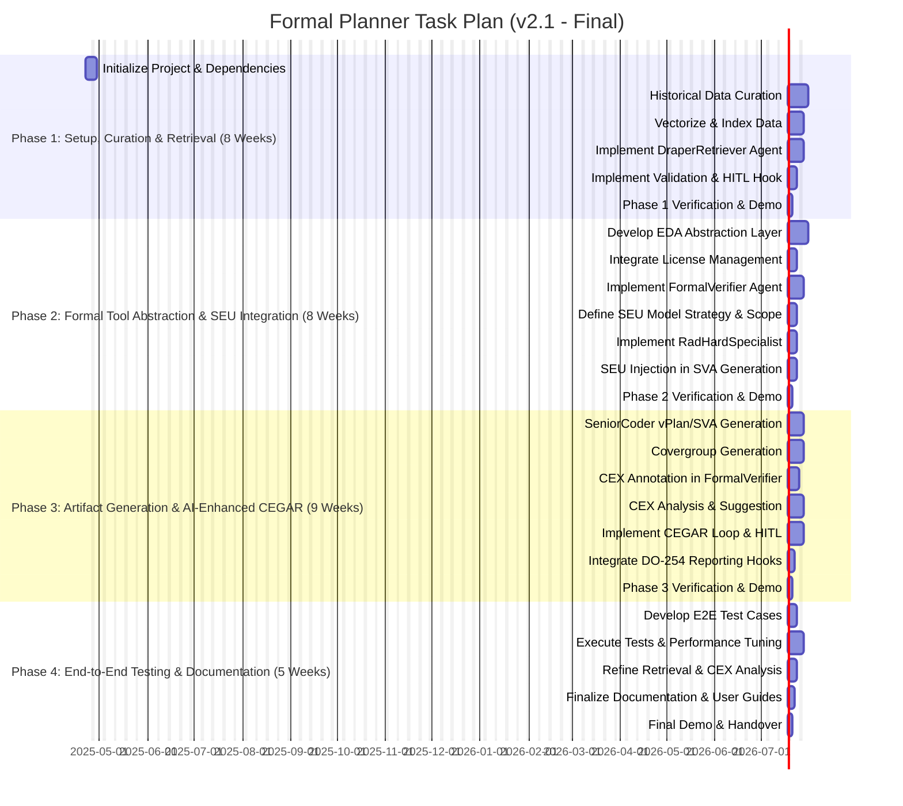

# Objective: AI-Driven Formal Verification Planner for DO-254

Develop an MCP-compatible, on-premises agentic R&D system (**draper-mcp-formal-planner**) to accelerate and enhance DO-254 formal verification of Draper's radiation-hardened hardware. The system leverages curated historical data, integrates SEU models, automates artifact generation, assists in AI-driven CEGAR loops, and incorporates human oversight for critical decisions.

---

# Core Components

- **Agentic Workflow (MCP):**  
  Orchestrated by `Boomerang`, coordinating:  
  `Planner`, `DraperRetriever`, `SeniorCoder-Formal`, `FormalVerifier`, `RadHardSpecialist`.  
  Includes mandatory human-in-the-loop steps for property validation and complex counterexample analysis.

- **Curated Data Retriever:**  
  `DraperRetriever` agent queries a vector database of curated historical verification assets. Requires initial data curation.

- **EDA Tool Abstraction Layer:**  
  Python library wrapping formal tool interactions (initially VC Formal) and license management.

- **Artifact Generation:**  
  `SeniorCoder-Formal` generates vPlans, SEU-aware SVAs, and covergroups aligned with DO-254 objectives.

- **AI-Assisted CEGAR:**  
  `FormalVerifier` runs proofs and annotates counterexamples.  
  `SeniorCoder-Formal` analyzes annotated CEX, suggests refinements, escalates complex cases for human review.

- **Radiation Awareness:**  
  `RadHardSpecialist` integrates Draper SEU models into property generation and analysis.

- **Resource Management:**  
  `Boomerang` manages license checks and job queuing.

- **Packaging & Deployment:**  
  Secure on-premises deployment via Docker and `uv`, requiring GPU resources (H100 recommended).

---

# Recovery Plan (If Session Crashes)

1. Review `taskplan.md` for last completed task `[X]`.
2. Resume at the first incomplete task `[ ]`.
3. Relaunch environment and dependencies (`docker compose up -d`), restart MCP agents.
4. Instruct `Planner` to continue.

---

# Task Plan Visualization

*(See `taskplan.md` for detailed Gantt chart)*

---

# Final Notes

- Integrates **SEU models** into property generation and verification.
- Uses **AI-assisted CEGAR** with human-in-the-loop review for certification rigor.
- Automates artifact generation aligned with DO-254.
- Designed for **secure, on-premises deployment** with scalable GPU acceleration.
