# 🎯 Objective: AI-Driven Formal Verification Planner for DO-254

> **Note:** On-premises deployment significantly aids ITAR compliance by keeping data internal. Full compliance requires additional organizational controls (access restrictions, audits, training, documentation).

---

Develop an MCP-compatible, on-premises agentic R&D system (**draper-mcp-formal-planner**) to accelerate and enhance DO-254 formal verification of Draper's radiation-hardened hardware. The system leverages curated historical data, integrates SEU models, automates artifact generation, assists in AI-driven CEGAR loops, and incorporates human oversight for critical decisions.

---

## 🏗️ Core Components

- **🤖 Agentic Workflow (MCP):**  
  Orchestrated by `Boomerang`, coordinating:  
  `Planner`, `DraperRetriever`, `SeniorCoder-Formal`, `FormalVerifier`, `RadHardSpecialist`.  
  Includes mandatory human-in-the-loop steps for property validation and complex counterexample analysis.

- **🔍 Curated Data Retriever:**  
  `DraperRetriever` agent queries a vector database of curated historical verification assets. Requires initial data curation.

- **🛠️ EDA Tool Abstraction Layer:**  
  Python library wrapping formal tool interactions (initially VC Formal) and license management.

- **📄 Artifact Generation:**  
  `SeniorCoder-Formal` generates vPlans, SEU-aware SVAs, and covergroups aligned with DO-254 objectives.

- **🔄 AI-Assisted CEGAR:**  
  `FormalVerifier` runs proofs and annotates counterexamples.  
  `SeniorCoder-Formal` analyzes annotated CEX, suggests refinements, escalates complex cases for human review.

- **☢️ Radiation Awareness:**  
  `RadHardSpecialist` integrates Draper SEU models into property generation and analysis.

- **⚡ Resource Management:**  
  `Boomerang` manages license checks and job queuing.

- **📦 Packaging & Deployment:**  
  Secure on-premises deployment via Docker and `uv`, requiring GPU resources (H100 recommended).

---

## 🔄 Recovery Plan (If Session Crashes)

1. 🔍 Review `taskplan.md` for last completed task `[X]`.
2. ▶️ Resume at the first incomplete task `[ ]`.
3. 🚀 Relaunch environment and dependencies (`docker compose up -d`), restart MCP agents.
4. 📝 Instruct `Planner` to continue.

---

## 📅 Task Plan Visualization

*(See `taskplan.md` for detailed Gantt chart)*

```mermaid
%%{init: { 'theme': 'base', 'themeVariables': {
  'fontFamily': '"Gotham", "Mulish", sans-serif',
  'primaryColor': '#F6F4EE',
  'primaryTextColor': '#10181F',
  'lineColor': '#10181F',
  'secondaryColor': '#dcdcdc',
  'tertiaryColor': '#555',
  'gantt': {
    'sectionTextColor': '#10181F',
    'taskTextColor': '#10181F',
    'taskBorderColor': '#10181F',
    'taskBkgColor': '#F6F4EE',
    'activeTaskBkgColor': '#dcdcdc',
    'activeTaskBorderColor': '#10181F',
    'doneTaskBkgColor': '#555',
    'doneTaskBorderColor': '#10181F',
    'critTaskBkgColor': '#FF4611',
    'critTaskBorderColor': '#10181F',
    'gridColor': '#dcdcdc'
  }
}}}%%
gantt
    dateFormat  YYYY-MM-DD
    title       Formal Planner Task Plan (v2.1 - Final)
    excludes    weekends

    section "Setup, Curation & Retrieval (8 weeks)"
    Init Project                              :done, P1T1, 2025-04-22, 5d
    Data Curation                             :active, P1T2, after P1T1, 10d
    Vectorize Data                            :P1T3, after P1T2, 7d
    DraperRetriever                           :P1T4, after P1T3, 7d
    Validation & HITL                        :P1T5, after P1T4, 5d
    Phase 1 Demo                              :P1T6, after P1T5, 2d

    section "Formal Tool Abstraction & SEU Integration (8 weeks)"
    EDA Abstraction                           :P2T1, after P1T6, 10d
    License Mgmt                              :P2T2, after P2T1, 5d
    FormalVerifier                            :P2T3, after P2T1, 7d
    SEU Strategy                              :P2T4, after P1T6, 5d
    RadHardSpecialist                         :P2T5, after P2T4, 5d
    SEU Injection                             :P2T6, after P2T5, 5d
    Phase 2 Demo                              :P2T7, after P2T6, 2d

    section "Artifact Generation & AI-Enhanced CEGAR (9 weeks)"
    SeniorCoder vPlan…                      :P3T1, after P2T7, 7d
    Covergroups                              :P3T2, after P3T1, 7d
    CEX Annotation                           :P3T3, after P2T7, 6d
    CEX Analysis                             :P3T4, after P3T3, 7d
    CEGAR Loop & HITL                       :P3T5, after P3T4, 7d
    DO-254 Hooks                            :P3T6, after P3T5, 3d
    Phase 3 Demo                            :P3T7, after P3T6, 2d

    section "End-to-End Testing & Documentation (5 weeks)"
    E2E Tests                                :P4T1, after P3T7, 5d
    Tests & Tuning                          :P4T2, after P4T1, 7d
    Refine Retrieval                         :P4T3, after P4T2, 5d
    Finalize Docs                            :P4T4, after P4T3, 3d
    Demo & Handover                         :P4T5, after P4T4, 2d
```

---

## 📝 Final Notes

- ☢️ Integrates **SEU models** into property generation and verification.
- 🔄 Uses **AI-assisted CEGAR** with human-in-the-loop review for certification rigor.
- 📄 Automates artifact generation aligned with DO-254.
- 🏢 Designed for **secure, on-premises deployment** with scalable GPU acceleration.

---

## 🔒 Security Implementation Checklist

### Access Control
- Enforce strict RBAC and ABAC policies for all agents, developers, and reviewers.
- Remove or disable all default accounts in formal tools, databases, and internal services.
- Prohibit shared credentials; assign unique, auditable identities to each user and agent.
- Segment design data, verification results, and credentials into isolated database schemas.
- Continuously audit access logs and monitor for anomalous activities.

### Key Management
- Store signing keys in HSMs or secure vaults.
- Automate key rotation schedules.
- Restrict key access to authorized signing agents and admins only.
- Separate key management duties from verification roles.
- Log all key lifecycle events.

### Audit Trails
- Centralize encrypted, immutable logs of agent actions, verification runs, signing, and reviews.
- Include timestamps, user/agent IDs, and event types.
- Enable alerts on suspicious activities.
- Require MFA or certificates for log access.
- Review logs regularly.

### Insider Threats
- Use behavioral analytics to detect anomalous user/agent behavior.
- Enforce least privilege across all roles.
- Conduct insider threat training.
- Perform periodic risk assessments.
- Establish an insider threat response team.

### Recovery Plan Security
- Protect backups and recovery images with cryptographic checksums.
- Require MFA for recovery operations.
- Isolate recovery infrastructure from operational networks.
- Test recovery procedures regularly.
- Log all recovery actions.

### Social Engineering Defense
- Maintain incident response playbooks for phishing and impersonation.
- Conduct phishing simulations.
- Implement email filtering, URL inspection, and attachment sandboxing.
- Use social engineering testing tools.
- Integrate social engineering defense into training.
