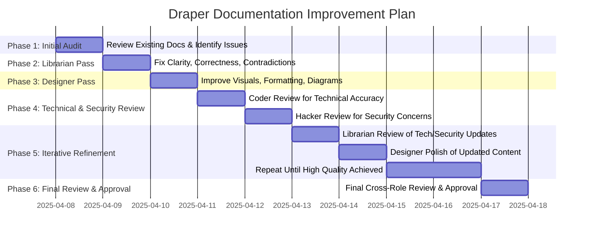

# Objective
Iteratively improve the documentation quality, clarity, accuracy, technical correctness, security awareness, and visual appeal of the following files:

- `draper_exploit_evo/README.md`
- `draper_exploit_evo/task.md`
- `draper_formal_planner/README.md`
- `draper_formal_planner/task.md`

using multi-role collaboration, especially Librarian, Designer, Coder roles, and Hacker, with support from other roles as needed.

---

# Core Approach

- **Librarian:** Ensure clarity, comprehension, factual correctness, and no contradictions.
- **Designer:** Enhance visual quality, formatting, diagrams (consult `docs/mermaid_reference.md` for mermaid charts).
- **Coder Roles (Intern, Junior, Senior):** Review technical feasibility, implementation accuracy, and code-related content.
- **Hacker:** Review security-related aspects, identify potential concerns, and suggest clarifications.
- **Ask-Perplexity:** All roles should use the ask-perplexity tool if additional information or clarification is needed.
- **Iterate:** Repeat multi-role passes until documentation meets high standards.

---

# Recovery Plan (If Session Crashes)

1. Review this task plan document for the last completed `[X]` task.
2. Resume at the next `[ ]` task.
3. Relaunch environment if needed.
4. Continue iterative improvements.

---

# Task Plan Visualization

---

# Detailed Task List

## Phase 1: Initial Audit

- [X] **Task 1.1: Review Existing Documentation**
  - Action: All roles review the four target files.
  - Identify clarity issues, factual errors, contradictions, technical inaccuracies, security concerns, poor formatting, and visual deficiencies.
  - Deliverable: List of prioritized issues for each file.

## Phase 2: Librarian Pass

- [X] **Task 2.1: Improve Clarity and Correctness**
  - Action: Librarian revises content for clarity, comprehension, factual accuracy, and consistency.
  - Use ask-perplexity if unsure about any content.
  - Deliverable: Updated files with clearer, more accurate content.

## Phase 3: Designer Pass

- [X] **Task 3.1: Enhance Visual Quality**
  - Action: Designer improves formatting, layout, and visual appeal.
  - Update or add mermaid diagrams, consulting `docs/mermaid_reference.md`.
  - Use ask-perplexity for design inspiration or best practices.
  - Deliverable: Visually improved documentation.

## Phase 4: Technical & Security Review

- [X] **Task 4.1: Coder Review for Technical Accuracy**
  - Action: Coder roles review technical explanations, code snippets, workflows, and implementation details.
  - Suggest improvements or corrections.
  - Use ask-perplexity if needed.
  - Deliverable: Technically accurate documentation.

- [X] **Task 4.2: Hacker Review for Security Concerns**
  - Action: Hacker reviews documentation for potential security issues, misleading statements, or missing warnings.
  - Suggest clarifications or improvements.
  - Use ask-perplexity if needed.
  - Deliverable: Security-aware documentation.

## Phase 5: Iterative Refinement

- [X] **Task 5.1: Librarian Review of Tech/Security Updates**
  - Action: Librarian checks Coder and Hacker updates for clarity and correctness.
  - Deliverable: Further refined documentation.

- [X] **Task 5.2: Designer Polish of Updated Content**
  - Action: Designer polishes any new or modified content.
  - Deliverable: Further visually improved documentation.

- [X] **Task 5.3: Repeat Refinement Loop**
  - Action: Repeat multi-role passes as needed.
  - Deliverable: High-quality, clear, accurate, secure, and visually appealing documentation.

## Phase 6: Final Review & Approval

- [X] **Task 6.1: Cross-Role Final Review**
  - Action: All roles perform a final review.
  - Confirm clarity, correctness, technical accuracy, security awareness, visual quality, and completeness.
  - Deliverable: Approved, production-ready documentation.

- [X] **Task 6.2: Address Final Security Documentation Gaps**
  - Action: Coordinate Hacker, Coder, and Librarian roles to update the four target documents, incorporating detailed specifications for access control, key management, audit trails, insider threat mitigation, and secure recovery plans based on Task 6.1 feedback.
  - Deliverable: Updated documentation addressing critical security concerns.

---

# Notes

- Roles should document any lessons learned in `src/mcp_litellm/docs/lessons_learned.json`.
- Use version control (`git add`, `commit`, `tag`) after each phase completion.
- Escalate unresolved issues to Planner or human supervisor as needed.